This is the companion repository for the paper **"An Event Study Framework For Analyzing Bidirectional Causality Between House Prices and Premium Café Entry" accepted at [The 12th IEEE International Conference on Data Science and Advanced Analytics (DSAA)](https://dsaa.ieee.org/2025/technical-program/).**

# Objective
Our study tries to answer two questions:
1.	**Does a higher pre-existing house price index (HPI) relative to matched controls make Starbucks’ entry more likely?** In other words, does Starbucks, more often than not, enter neighborhoods that see higher than average house price growth? This is the **reverse effect**. If it exists, **reverse causation** is plausible although not guaranteed, because **anticipation** is likely. Neighborhoods that anticipate Starbucks' entry might start become dearer (especially close to the entry year). We'll examine this point closely soon. The effect of **confounders** is equally important. Variables such as mass transit improvements could boost house prices. But they also increase foot traffic, population density, and with that, make the neighborhood attractive to a cafe such as Starbucks. Thus, it's a strong statement to say that Starbucks proactively _selects_ for fast growing neighborhoods, and _that_ makes it a very interesting topic of research. 
2.	**Is Starbucks’ entry followed by a higher HPI relative to matched controls?** In other words, do neighborhoods that witness a first-time entry of Starbucks also witness a higher than average house price growth, post-entry? This is the **forward effect**. It is also the classic correlation versus forward causation question subject to the effect of **confounders**.  

> [!NOTE]
> Our study was able to simultaneously estimate both the reverse and the forward effect using a single statistical model.

# The Hedonic Model and the Problem of Endogeneity
A setting where a price variable (such as HPI) is a function of one or more variables lends itself to a [Hedonic Regression Model](https://en.wikipedia.org/wiki/Hedonic_regression). In a hedonic setting, the coefficients of the explanatory variables act as utilities (negative or positive). Ours is a hedonic setting, and as with all such settings, it is vulnerable to endogeneity. Endogeneity occurs when you omit one or more important variables that are correlated with the response variable. Omission of such variables causes their effect to hide inside (and operate from) the error term of the model. If any of those omitted variables are also correlated with the one of the variables in your model, it baises the coefficients of the model's variables that they are correlated with. In simple words, it makes them appear more or less important than they actually are. In a hedonic setting, it's impossible to completely avoid endogeneity. But you can minimize it through the judicious choice of model, and the use of covariates. Additionally, we add a **placebo arm** – a falsification test – to verify that any pre or post store-opening effects we observed weren’t driven entirely by non-Starbucks covariates, omitted variables, or spurious trends or artifacts in our data or specification.

# Data Sources
Our study uses the following data:
* **Starbucks store locations as of Feb 2017, Jan 2022, and Sep 2024**. The Feb 2017 and Jan 2022 files were [sourced](https://www.kaggle.com/datasets/kukuroo3/starbucks-locations-worldwide-2021-version/versions/2) from [Kaggle](https://www.kaggle.com/datasets/starbucks/store-locations/). The Sep 2024 file was purchased from AggData.com. 
* **The Starbucks store opening dates** data was obtained from the publicly available data on the site https://www.starbuckseverywhere.net/ 
* **U.S. HPI data indexed by ZIP and year** was downloaded from [FHFA](https://www.fhfa.gov/data/hpi/datasets?tab=annual-data)
* **Adjusted Gross Income (AGI) at a ZIP level** was sourced from the U.S. [Internal Revenue Service (IRS) website](https://www.irs.gov/statistics/soi-tax-stats-individual-income-tax-statistics-zip-code-data-soi)
* [**Google Maps**] and the [**Starbucks Store Locator**](https://www.starbucks.com/store-locator) was used to validate and correct errors in Starbucks store locations

> [!NOTE]
> To reproduce the results, you do not need to download the the raw data files from original sources. I have uploaded the cleaned and partially pre-processed files into this repo. You can simply use these files.

# Statistical Model
Our study uses the **Two Way Fixed Effects (TWFE) event study model** as the primary statistical device to simulataneously examine both the reverse and the forward effects. The TWFE event study is a generalization of the simple 2x2 Difference-In-Differences (DiD) model. The 2x2 DiD has the following form:
```math
Y_{it} = \alpha + \gamma \, Treated_i + \lambda \, Post_t + \tau (Treated_i \times Post_t) + \varepsilon_{it}
```
Here, $Y_{it}$ is the response for unit $i$ at time $t$.
$Treated_i$ = 0 if unit $i$ belongs to the Treatment group, and 0 if belongs to Control.  
$Post_i$ = 0 if $t$ is pre-treatment time, 0 otherwise.  

In our study:
* *Y_{it}* is the log of HPI in unit $i$ at time $t$
* Each unit $i$ is a unique ZIP code (neighborhood) 
* Time $t$ is the year
* ZIP $i$ is **Treated** if it witnessed a first-time entry of Starbucks in the period Feb 2017 to Jan 2022. It's a **Control** ZIP if it remained Starbucks-free from Feb 2017 to Sep 2024.  

However, the basic 2x2 DiD isn't suitable for our study for the following reasons:
* The 2x2 DiD assumes that all units are treated at the same time. But in reality, Starbucks entered different ZIPs for the first time in different years. Our study accounts for such staggered entry.
* We also want to estimate the effect of Starbucks' entry on HPI growth at each year for a block of years prior to year of entry and another block of years post-entry. Thus, we want to study both the **forward** and the **reverse** effect using the same model. 

The TWFE event study model accounts for staggered entry, and it lets us simultaneously estimate the pre- and the post-entry effect on house prices on an year-by-year basis. Following is its equation:
```math
\log(HPI_{it}) = \sum_{\tau=-4}^{5} \beta_{\tau} D_{\tau,it} + \gamma_t + \delta_1 \cdot AGI_{it} 
+ \delta_2 \cdot (prev\_2yr\_hpi\_change)_{it} 
+ \delta_3 \cdot (prev\_5yr\_hpi\_change)_{it} 
+ \varepsilon_{it}
```
In the above model, $HPI_{it}$ is the HPI in ZIP $i$ at time $t$. HPI being a price variable has a skewed distribution. The logarithm corrects the skew and stabilizes the variance.  

$D_{𝜏,it}$ are event time dummies such that $D_{𝜏,it}$ = 1 if $t$ - $t_{entry,i}$ = $𝜏$, and 0 otherwise, $t_{entry,i}$ being the year of first entry of Starbucks into ZIP $i$.  

$𝛾_t$ represent the year fixed effects. They capture macroeconomic trends and time-specific shocks affecting all ZIPs at time $t$. $t$ is varied from 2013 to 2022 (2012 being left out to avoid perfect multicollinearity).  

$AGI_{it}$ is the average Adjusted Gross Income (AGI) in ZIP $i$ at time $t$. It serves as a proxy for neighborhood affluence and a weak proxy for gentrification.  
The $(prev\_2yr\_hpi\_change)_{it}$ and $(prev\_5yr\_hpi\_change)_{it}$ variables capture the short-term and-long term pre-entry price momentum in ZIP $i$ running up to time $t$.  

$ϵ_{it}$ is the error term.  

We varied $𝜏$ from -5 to 5, leaving out 𝜏 =-5 to avoid perfect multicollinearity. Thus, the baseline year is $𝜏$ =-5. All estimated effects are  interpreted w.r.t. the HPI in this year in both the treated and the control ZIPs.  


The TWFE event study expands the scope of the basic 2x2 DiD in the following important ways:
* The pre- versus post-treatment year effect $\gamma$ in the DiD is broken out into a full set of year fixed effects $\gamma_t$
* The single, aggregate treatment effect $\tau$ is broken out into year-wise effects $D_{𝜏,it}$. We'll be keeping a close eye on the trajectory and the significance of the coefficients $\beta_{\tau}$. They will help us estimate the year-wise treatment effect of Starbuck's entry on HPI.
* Finally, $\alpha$ in the  DiD is broken out into unit-specific FEs.

Speaking of unit FEs, notice that our TWFE model leaves them out. We'll have to more to say (and show) about this design choice later.

## What do we expect to find?

Our focus will be on the coefficients $\beta_{\tau}$ of the event variables $D_{𝜏,it}$. **A robust, positive trend in the pre-entry coefficients suggests (but does not prove) reverse causation** between house prices and Starbucks entry (the reverse path). A similar **robust positive trend in the post-entry coefficients suggests forward causation** (the forward path).  

Even with positive, significant coefficients, it's entirely likely that Starbucks has nothing to do with house price growth. The effects might be almost entirely explanable using non-Starbucks covariates and by the structure of the model itself. To minimize this possibility, we conduct a placebo test in which we open "fake" Starbucks store in some of the ZIPs in the control group and re-run the model with the fake stores as Treatment, along with a matched set of controls. **In the placebo arm, we would expect the pre- and post-entry coefficients to be statistically indistinguishable from zero**. 

## A note about the parallel trends assumption of DiD models
In a 2x2 DiD setting, the conventional definition of parallel trends is that in the absence of treatment, the treated and control groups would have experienced the same average outcome trend over time.  

In other words, the mean pre- to post-treatment change in the response experienced by the treated group had they actually not been treated, is is the same as the mean pre- to post-change in response experienced by the control group.  

Careful matching of controls makes the assumption more plausible (although it doesn’t guarantee it) and that’s one of the things we have spent a lot of time on in our study.  

In a TWFE event study that does not study reverse causation, we would expect the pre-trend event coefficients to be statistically insignificant. However, we are explicitly testing for reverse causation, i.e. selection on trend. So positive pre-trend coefficients is the effect we _expect_ to see. Therefore **we do not assume strict parallel trends**. Instead, we rely on tests such as **donut** on the pre-trend coefficients to rule out **anticipation** to which reverse causative studies are especially vulnerable. We also examine the **joint significance of pre-entry coefficients in the placebo test** and expect them to be jointly insignficant. 


# Method
The following procedure was followed to conduct this study:
1. Clean-up the data
2. Pre-process the data and prepare the training data set for the real (non-placebo) study
3. Train the TWFE event study model on the real data set
4. Analyze the training results from the real study
5. Repeat steps 2,3,4 for the placebo study
6. Additionally, in this repo, we will address issues of cohort-level heterogeneity and control contamination that are commonly raised about TWFE event study models in staggered treatment settings such as ours. Specifically, we'll validate the findings from the TWFE event study using a second model - the [Borusyak–Jaravel–Spiess (BJS) model](https://academic.oup.com/restud/article/91/6/3253/7601390) which avoids some of these issues. We'll also provide evidence based justification for dropping the ZIP FEs in the model's design.

In the rest of this README, we'll work through the above sections and show our results.


## Data clean-up
Data clean-up primarily involves resolving discrepancies between addresses of Starbucks locations in the 2017, 2022, and 2024 files. It proceeds in the following steps:
1. Use a TF-IDF based vectorizer and cosine-similarity to do a pair-wise match. Set the cosine-similarity threshold to 90%. Each paired matching operation (2017-2022, 2022-2024) yields a set of matched addresses, unmatched addresses, and semi-matched addresses (ones for which the similarity score >= 90% but one of store number, city, and ZIP do not match).  
2. Manually resolve all discrepancies and fix incorrect addresses using data on Google Maps and the [**Google Maps**] and the [**Starbucks Store Locator**](https://www.starbucks.com/store-locator)  

The outcome of the above clean-up procedure yields the files:
* **Starbucks_Stores_Feb2017_CORRECT_ZIPS.csv**
* **Starbucks_Stores_Jan2022_CORRECT_ZIPS.csv**, and 
* **Starbucks_Stores_Sep2024.csv**   

All of which are checked into this repo. You can use these files as is, i.e. you don't need to perform the data cleanup from scratch (and trust me, you don't want to either. It's a lot of grunt work!)

## Data preprocessing
Pre-processing proceeds through the following steps:

1. We load the 3 files into Pandas DataFrames, filter out non-US ZIPs, and do some more ZIP code cleanup.
```python
#Read the Starbucks store count files into Pandas Dataframes

df_sb_2017 = pd.read_csv('Starbucks_Stores_Feb2017_CORRECT_ZIPS.csv', encoding = "ISO-8859-1")
df_sb_2022 = pd.read_csv('Starbucks_Stores_Jan2022_CORRECT_ZIPS.csv', encoding = "ISO-8859-1")
df_sb_2024 = pd.read_csv('Starbucks_Stores_Sep2024.csv', encoding = "ISO-8859-1")

# Filter to include only US locations (Country == 'US')
df_sb_2017_us = df_sb_2017[df_sb_2017['Country'] == 'US']
df_sb_2017_us = df_sb_2017_us.reset_index()

df_sb_2022_us = df_sb_2022[df_sb_2022['countryCode'] == 'US']
df_sb_2022_us = df_sb_2022_us.reset_index()

df_sb_2024_us = df_sb_2024[df_sb_2024['country_code'] == 'US']
df_sb_2024_us = df_sb_2024_us.reset_index()

# Function to clean the Postcode, remove 4-digit extension, 
# Add a '0' fix to 4-digit and 8-digit postcodes
def clean_postcode(postcode):
    str_postcode = str(postcode).strip()
    if len(str_postcode) == 4:
        str_postcode = '0' + str_postcode
    if len(str_postcode) == 8:
        if str_postcode.startswith('0'):
            str_postcode = str_postcode + '0'
        else:
            str_postcode = '0' + str_postcode
    if len(str_postcode) == 9:
        return str_postcode[:5]
    return str_postcode

df_sb_2017_us['Postcode'] = df_sb_2017_us['Postcode'].apply(clean_postcode)
df_sb_2022_us['Postcode'] = df_sb_2022_us['postalCode'].apply(clean_postcode)
df_sb_2024_us['Postcode'] = df_sb_2024_us['zip_code'].apply(clean_postcode)

print('# Starbucks US locations in Feb 2017 file=',len(df_sb_2017_us))
print('# Starbucks US locations in Jan 2022 file=',len(df_sb_2022_us))
print('# Starbucks US locations in Sep 2024 file=',len(df_sb_2024_us))

print('# Unique US ZIP codes with Starbucks in Feb 2017 file=',len(df_sb_2017_us["Postcode"].unique()))
print('# Unique US ZIP codes with Starbucks in Feb 2022 file=',len(df_sb_2022_us["Postcode"].unique()))
print('# Unique US ZIP codes with Starbucks in Feb 2024 file=',len(df_sb_2024_us["Postcode"].unique()))
```  
You should see the following output:  
> \# Starbucks US locations in Feb 2017 file= 13608  
> \# Starbucks US locations in Jan 2022 file= 15003  
> \# Starbucks US locations in Sep 2024 file= 16529  
> \# Unique US ZIP codes with Starbucks in Feb 2017 file= 5863  
> \# Unique US ZIP codes with Starbucks in Jan 2022 file= 6499  
> \# Unique US ZIP codes with Starbucks in Sep 2024 file= 7125  

You should end up with 3 Dataframes for 2017, 2022 and 2024 with respectively 13608, 15003, 16529 Starbucks store locations distributed among respectively 5863, 6499, and 7125 unique ZIPs.  

2. From the 2022 and 2017 Dataframes, we build a new Dataframe containing the ZIPs that saw a first-time entry of Starbucks between Feb 2017 and Jan 2022 and the set of stores corrosponding to those ZIPs. We'll also do a quick data sanity check to verify there are no duplicate stores lurking in the data.   

```python
# Get zips in 2022 that were not there in 2017

zip_2017 = set(df_sb_2017_us['Postcode'].dropna().unique())

zip_2022 = set(df_sb_2022_us['Postcode'].dropna().unique())

new_zip_codes_2022 = zip_2022 - zip_2017

# Get the list of stores corresponding to these zips.
# df_new_zip_new_stores_2022 contains only those ZIPs which did not contain any Starbucks stores in Feb 2017, 
# and in which one *or more* stores opened at some point between Feb 2017 and Jan 2022
df_new_zip_new_stores_2022 = df_sb_2022_us[
    df_sb_2022_us['Postcode'].isin(new_zip_codes_2022)
].copy()

print('Num new stores in 2022 after filtering out ZIP codes already having one store in 2017:',len(df_new_zip_new_stores_2022))

# Verify no duplicate store numbers in df_sb_2017_us
print('Duplicate store numbers in df_sb_2017_us ?',(df_sb_2017_us.groupby('Store Number').count().sort_values(by='Country', ascending=False).iloc[0]['Country'] > 1))

# Verify no duplicate store numbers in df_sb_2022_us
print('Duplicate store numbers in df_sb_2022_us ?',(df_sb_2022_us.groupby('storeNumber').count().sort_values(by='countryCode', ascending=False).iloc[0]['countryCode'] > 1))

# Verify no duplicate store numbers in df_new_zip_new_stores_2022
print('Duplicate store numbers in df_new_zip_new_stores_2022 ?',(df_new_zip_new_stores_2022.groupby('storeNumber').count().sort_values(by='countryCode', ascending=False).iloc[0]['countryCode'] > 1))

df_sb_2017_us[df_sb_2017_us['Store Number'].isin(list(df_new_zip_new_stores_2022['storeNumber']))].to_csv('common_store_nums.csv')
```  
You should see the following output:  
> Num new stores in 2022 after filtering out ZIP codes already having one store in 2017: 963  
> Duplicate store numbers in df_sb_2017_us ? False  
> Duplicate store numbers in df_sb_2022_us ? False  
> Duplicate store numbers in df_new_zip_new_stores_2022 ? False  


3. Next, we populate the store opening dates in the new stores Dataframe. To do that, we begin by loading the data from the starbucks_store_opening_dates_us_ca_14Feb2025.csv (available in this repo) into a Pandas Dataframe. The starbucks_store_opening_dates_us_ca_14Feb2025.csv contains the store opening dates from the [Starbucks Everywhere](https://www.starbuckseverywhere.net/) website. For each row in this Dataframe, we construct a name 'slug' using the Name, City and State data in this file, and we use this slug to match with the slug column in the new stores Dataframe. We use the state and city columns to sharpen the match. Using this method, when a row from store opening dates Dataframe matches a row in the new store Dataframe, we copy over the store opening date into the new store Dataframe. We also do a couple of additional heuristic matches to maximize the number of stores that end up with a valid store opening date.  

```python
file_path = "starbucks_store_opening_dates_us_ca_14Feb2025.csv"
df_sb_store_open_dates = pd.read_csv(file_path, sep="\t", parse_dates=['Opened'], dayfirst=False)

print('Number of records in the df_sb_store_open_dates=',len(df_sb_store_open_dates))

# Preprocess store open dates file.

# Add empty 'opening_date' and 'closing_date' columns
df_new_zip_new_stores_2022['opening_date'] = pd.NaT
df_new_zip_new_stores_2022['closing_date'] = pd.NaT

# Function to convert store name to URL slug
def generate_slug(name):
    # Convert to lowercase
    name = name.lower()
    # Remove non-alphanumeric characters except spaces and hyphens
    name = re.sub(r'[^\w\s-]', '', name)  
    # Replace multiple spaces or hyphens with a single hyphen
    name = re.sub(r'[\s-]+', '-', name).strip('-')  
    return name

# Populate slug column
df_sb_store_open_dates['slug'] = df_sb_store_open_dates['Name'].apply(generate_slug)

# List of all U.S. state names (without spaces, as they appear in "Market")
us_state_names = {state.name.replace(" ", ""): state.abbr for state in us.states.STATES}

# Function to extract state abbreviation from 'Market' (format: "State Name\AreaName")
def get_state_abbreviation(market):
    """
    Extracts the 2-letter state abbreviation from the 'Market' column.
    Handles cases where state names are concatenated without spaces.
    """
    # Extract the state portion before "\"
    state_part = market.split('\\')[0].strip().lower()

    # Find a matching state name in our predefined dictionary
    for state_name, state_abbr in us_state_names.items():
        if state_part.startswith(state_name.lower()):  # Check if the state name matches
            return state_abbr
    
    return None  # Return None if no match is found

# Populate state abbreviation column
df_sb_store_open_dates['state_abbr'] = df_sb_store_open_dates['Market'].apply(get_state_abbreviation)

# Merge the Opened column from df_sb_store_open_dates into df_new_zip_new_stores_2022
# based on slug (prefix match), city, and state

updated_count = 0

for index, row in df_sb_store_open_dates.iterrows():
    slug = row['slug']
    city = row['City'].strip().lower()
    state = row['state_abbr']

    # Find matching stores in df_unique_zip_new_stores_2022
    match_index = df_new_zip_new_stores_2022[
        (df_new_zip_new_stores_2022['city'].str.strip().str.lower() == city) &
        (df_new_zip_new_stores_2022['countrySubdivisionCode'] == state) & 
        (df_new_zip_new_stores_2022['slug'].str.startswith(slug, na=False))
    ].index
    updated_count += len(match_index)
    if len(match_index) > 1:
        print(match_index)
    # Assign the opening date
    df_new_zip_new_stores_2022.loc[match_index, 'opening_date'] = row['Opened']

# Ensure 'opening_date' is in datetime format
df_new_zip_new_stores_2022.loc[:, 'opening_date'] = pd.to_datetime(df_new_zip_new_stores_2022['opening_date'])

print('Num rows in df_unique_zip_new_stores_2022=',len(df_new_zip_new_stores_2022))
print('Num rows updated=',updated_count)

# Run another round of slug matching based on matching a sequence of two or more tokens separated by
# a '-' in the slug column of df_sb_store_open_dates match the corresponding sequence of 
# two or more tokens separated by a '-' in the slug column of df_unique_zip_new_stores_2022 
def get_token_sequences(slug, min_length=2):
    """
    Extracts all sequences of 'min_length' or more consecutive tokens from a slug.
    """
    tokens = slug.split('-')
    sequences = []
    
    # Generate all possible consecutive sequences of at least 'min_length' tokens
    for length in range(min_length, len(tokens) + 1):  # Length of sequence
        for i in range(len(tokens) - length + 1):  # Start index
            sequences.append('-'.join(tokens[i:i+length]))  # Join tokens into a sequence
            
    return sequences

# Define the set of allowed storeNumbers
allowed_store_numbers = {
    "16500-171804", "63614-297937", "66101-299318", "65666-298969", "62566-296535",
    "64980-297374", "63554-297033", "65318-297706", "63532-297536", "62594-293500",
    "62906-295007", "62036-295964", "61739-295506", "55077-288371", "58902-292643",
    "57941-291373", "56720-289936", "55079-288372", "48856-261871", "53412-284007",
    "52364-280528", "49606-270104", "54127-284925", "48613-264047", "24569-237077"
}

# Track how many additional stores get updated
additional_updates = 0

# Pre-filter df_unique_zip_new_stores_2022 to only include allowed storeNumbers
filtered_df = df_new_zip_new_stores_2022[df_new_zip_new_stores_2022['storeNumber'].isin(allowed_store_numbers)]

# Iterate over store opening records for a second round of matching
for index, row in df_sb_store_open_dates.iterrows():
    slug_sequences = get_token_sequences(row['slug'])  # Generate possible token sequences
    city = row['City'].strip().lower()
    state = row['state_abbr']

    # Search for any of these sequences in df_unique_zip_new_stores_2022
    for seq in slug_sequences:
        match_df = filtered_df[
            (filtered_df['opening_date'].isna()) &
            (filtered_df['city'].str.strip().str.lower() == city) &
            (filtered_df['countrySubdivisionCode'] == state) & 
            filtered_df['slug'].str.contains(seq, na=False)            
        ]
        
        # If matches found, update opening_date
        if not match_df.empty:
            df_new_zip_new_stores_2022.loc[match_df.index, 'opening_date'] = row['Opened']
            additional_updates += len(match_df)

            # Print matched slugs
            for match_index in match_df.index:
                matched_slug = df_new_zip_new_stores_2022.at[match_index, 'slug']
                slug = df_new_zip_new_stores_2022.at[match_index, 'slug']
                store_num = df_new_zip_new_stores_2022.at[match_index, 'storeNumber']
                store_addr = df_new_zip_new_stores_2022.at[match_index, 'streetAddressLine1']
                print(row['slug'],'|',matched_slug,'|',store_addr,'|',store_num)

            break  # Stop after the first successful sequence match

# Ensure 'opening_date' is in datetime format
df_new_zip_new_stores_2022.loc[:, 'opening_date'] = pd.to_datetime(df_new_zip_new_stores_2022['opening_date'])

# Display count of additional updates
print(f"Additional stores updated with an opening date in second matching round: {additional_updates}")
```  

Upon running step 3, you should end up with 550 stores in the new stores Dataframe with a valid store opening date, distributed among 531 unique ZIPs.  

4. Next, for each unique zip in in the new stores Dataframe, we'll identify the year in which the first Starbucks store opened in that ZIP. We'll store this first open year in a new Dataframe that groups the data from new stores Dataframe by ZIP code. Thus, the new grouped first-open-year Dataframe contains only two columns: Postcode, and first_open_year. While doing this grouping, we also drop the rows that do not contain a valid store open date and we drop a few rows of edge data.  


```python
# For each unique zip in df_new_zip_new_stores_2022, identify the year 
# in which the first Starbucks store opened in that zip
# Store this data in a new Dataframe called df_zip_first_open_year

# Remember that df_new_zip_new_stores_2022 contains only those ZIPs which did not contain any Starbucks stores in Feb 2017, 
# and in which one *or more* stores opened at some point between Feb 2017 and Jan 2022

df_new_zip_new_stores_2022_copy = df_new_zip_new_stores_2022.dropna(subset=['opening_date']).copy()

# Ensure opening_date is in datetime format
df_new_zip_new_stores_2022_copy.loc[:, 'opening_date'] = pd.to_datetime(df_new_zip_new_stores_2022_copy['opening_date'])

# Add the month and year fields
df_new_zip_new_stores_2022_copy['open_year'] = df_new_zip_new_stores_2022_copy['opening_date'].dt.year

# Filter rows where first_open_year is between 2017 and 2021.
# Doing so filters out the 6 rows where first_open_year < 2017 i.e. the ones with mismatched open dates.
# It filters out the 1 row from 2024 as it is outside the time-scope of this study
# It also filters the single row from Jan 2022 (there are no other rows with year=2022).
# In effect, df_new_zip_new_stores_2022_copy contains stores (and corresponding ZIPs) that opened between Feb 2017 and Dec 2021
df_new_zip_new_stores_2022_copy = df_new_zip_new_stores_2022_copy[
    (df_new_zip_new_stores_2022_copy['open_year'] >= 2017) & 
    (df_new_zip_new_stores_2022_copy['open_year'] <= 2021)]

# Group by ZIP code and get the first open year and month
# Thus, df_zip_first_open_year will contain exactly one row corresponding to each unique ZIP in df_new_zip_new_stores_2022_copy
# and that row will contain the year in which the first Starbucks opened in that ZIP at some point between Feb 2017 and Dec 2021
df_zip_first_open_year = (
    df_new_zip_new_stores_2022_copy
    .groupby('Postcode')['open_year']
    .min()  # Get the earliest year for each ZIP code
    .reset_index()  # Convert back to DataFrame
)

# Rename the open_year column
df_zip_first_open_year = df_zip_first_open_year.rename(columns={'open_year': 'first_open_year'}, errors='raise')

print('# zips in df_zip_first_open_year=',len(df_zip_first_open_year))
```  

The new grouped first-open-year Dataframe now contains 524 unique ZIPs.  Here's how it should look like:  

```python
	Postcode	first_open_year
0	01089	2021
1	01119	2020
2	01440	2021
3	01843	2019
4	01863	2021
...	...	...
519	98146	2017
520	98230	2018
521	98541	2019
522	98642	2021
523	98901	2020
524 rows × 2 columns
```  

5. Next, we load the ZIP-wise HPI data from the FHFA file into a Dataframe, add a percentage change column (hpi_change) which captures the Y-o-Y percentage change in HPI codes, and merge it with the first-open-year Dataframe on the ZIP code column. We also add two new columns in the marged Dataframe: An event_time column which is the integer difference between Year and first_open_year, and a starbucks_opened column which contains a 1 or 0 based on whether first_open_year column contains a valid value for that ZIP, in other worda, whether the ZIP experienced a first-time entry of Starbucks during Feb 2017 and Dec 2021.

```python
# Load the FHFA ZIP-5 HPI dataset from https://www.fhfa.gov/data/hpi/datasets?tab=additional-data

filename = 'hpi_at_bdl_zip5_22Oct2024.csv'
df_hpi_by_zip_and_year = pd.read_csv(
    filename,
    delimiter=",",
    dtype={"Five-Digit ZIP Code": str, "Year": int}
)

print('# of rows in FHFA ZIP-5 HPI dataset=',len(df_hpi_by_zip_and_year))

# Ensure ZIP is string for proper matching
df_hpi_by_zip_and_year['Five-Digit ZIP Code'] = df_hpi_by_zip_and_year['Five-Digit ZIP Code'].astype(str)

# Filter only relevant columns
df_hpi_filtered = df_hpi_by_zip_and_year[['Five-Digit ZIP Code', 'Year', 'HPI']].copy()

# Sort data by ZIP and Year for proper calculations
df_hpi_filtered = df_hpi_filtered.sort_values(by=['Five-Digit ZIP Code', 'Year'])

# Compute percentage change in HPI per ZIP code
df_hpi_filtered['hpi_change'] = df_hpi_filtered.groupby('Five-Digit ZIP Code')['HPI'].pct_change(fill_method=None) * 100

# Merge df_hpi_filtered with df_zip_first_open_year based on ZIP code
df_all = df_hpi_filtered.merge(df_zip_first_open_year, 
                               left_on='Five-Digit ZIP Code', 
                               right_on='Postcode', 
                               how='left')

# Create event_time as the difference between Year and first_open_year
df_all['event_time'] = df_all['Year'] - df_all['first_open_year']

# If a ZIP had a Starbucks opening, mark starbucks_opened as 1; otherwise, 0
df_all['starbucks_opened'] = df_all['first_open_year'].notna().astype(int)

# Drop redundant 'Five-Digit ZIP Code' column after merging
df_all.drop(columns=['Postcode'], inplace=True)

# Rename ZIP code column for consistency
df_all.rename(columns={'Five-Digit ZIP Code': 'Postcode'}, inplace=True)

# Reorder columns for readability
df_all = df_all[['Postcode', 'Year', 'HPI', 'starbucks_opened', 'first_open_year', 'event_time']]
```

The resulting merged Dataframe ought to look as follows:  

```python
	Postcode	Year	HPI	starbucks_opened	first_open_year	event_time
0	01001	1984	100.00	0	NaN	NaN
1	01001	1985	115.86	0	NaN	NaN
2	01001	1986	134.66	0	NaN	NaN
3	01001	1987	163.83	0	NaN	NaN
4	01001	1988	191.66	0	NaN	NaN
...	...	...	...	...	...	...
648249	99901	2019	293.32	0	NaN	NaN
648250	99901	2020	294.24	0	NaN	NaN
648251	99901	2021	311.14	0	NaN	NaN
648252	99901	2022	351.26	0	NaN	NaN
648253	99901	2023	364.40	0	NaN	NaN
648254 rows × 6 columns
```  

Since the FHFA file contains data about 12192 unique ZIPs (i.e. way more than in the first-open-year Dataframe), and it contains yearly HPI data for each ZIP, most rows in the merged Dataframe will contain 0 in the starbucks_opened column, and NaN in the first_open_year and event_time columns. Specifically, you'll find that the merged Dataframe will contain 18414 Starbucks-free ZIPs (starbucks_opened=0), and 510 ZIPs in which Starbucks opened for the first time in the Feb 2017 to Dec 2021 timeframe (starbucks_opened=1).  

6. Let's do a quick detour to look at the descriptive stats. We'll begin by examining the HPI profile of ZIPs in the year _prior_ to the year of first entry of Starbucks.  

```python
# What was the HPI profile of ZIPs in which Starbucks opened?

# For all treatment ZIPs, get the rows for the year prior to the one in which Starbucks opened
df_treatment_prior_year_row = df_all[df_all['starbucks_opened'].eq(1) & 
    df_all['Year'].eq(df_all['first_open_year']-1)].copy()

df_treatment_prior_year_row = df_treatment_prior_year_row.dropna(subset=['HPI'])

#Print the descritive stats
print(df_treatment_prior_year_row['HPI'].describe())

# Draw a histogram of HPI for the year prior to the one in which Starbucks opened

# Set the style for the plot
sns.set_theme(style="whitegrid")

# Create the histogram
plt.figure(figsize=(10, 6))
sns.histplot(df_treatment_prior_year_row['HPI'], bins=20, color="royalblue")

# Customize the plot
plt.xlabel("House Price Index (HPI)", fontsize=10)
plt.ylabel("Count of Starbucks Opened", fontsize=10)
plt.title("Distribution of HPI across treatment ZIPs in the year prior to year of first-entry", fontsize=16)
plt.xticks(fontsize=10)
plt.yticks(fontsize=10)

# Display the plot
plt.show()

```  

You should see the following descritive stats followed by the histogram.  

```python
count     505.000000
mean      377.088634
std       272.571103
min        99.540000
25%       225.790000
50%       293.320000
75%       423.020000
max      2396.310000
Name: HPI, dtype: float64
```

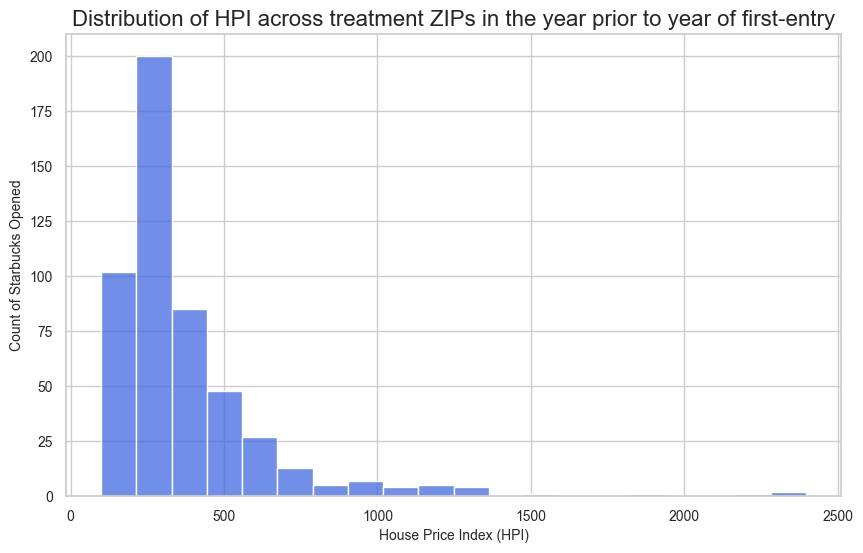  

Right away, this tells us two things:  
- HPI (being a price variable) has the familiar, skewed, power law distribution. This justifies regressing log(HPI) as against the raw variable.  
- Starbucks did not preferentially entry expensive neghborhoods. In fact, most of the first-time entries occurred in the middle price range (200 - 400).  

Let's also look at how the year of first entry is distributed across our treatment window. We need it to be more-or-less uniformly distributed across the treatment years.  
```python
# Draw a histogram of store open years for the treatment pool

df_treatment_hpi_prior_year_counts = df_treatment_prior_year_row.groupby('first_open_year').count()

# Set the style for the plot
sns.set_theme(style="whitegrid")

# Create the histogram
plt.figure(figsize=(10, 6))
sns.barplot(x=np.int32(np.array(df_treatment_hpi_prior_year_counts.index)), y=df_treatment_hpi_prior_year_counts['Year'], color="royalblue")

# Customize the plot
plt.xlabel("Year of First Entry", fontsize=10)
plt.ylabel("Count of Starbucks", fontsize=10)
plt.title("Distribution of Year of First Entry for Treatment ZIPs", fontsize=16)
plt.xticks(fontsize=10)
plt.yticks(fontsize=10)

# Display the plot
plt.show()
```  

Here's how the histogram looks like. Nothing to get freaked out about here.  

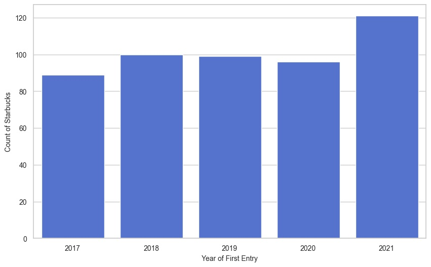  

Finally, let's also verify that our treatment ZIPs cover most of the U.S. i.e. they are not unusually concentrated in, say, the Northeastern states or in California at the exclusion of other states.  

```python
# Load uszips.csv
df_uszips = pd.read_csv('uszips.csv', dtype={"zip": str})  # Ensure ZIPs are strings

# Select relevant columns
df_uszips = df_uszips[['zip', 'city', 'state_id', 'state_name', 'county_name']]

# Convert column names for easy merging
df_uszips.rename(columns={'zip': 'Postcode'}, inplace=True)

# Merge uszips data into the df_treatment_prior_year_row dataframe
df_treatment_prior_year_row = df_treatment_prior_year_row.merge(df_uszips, on='Postcode', how='left')

# Get the group-wise counts
df_treatment_hpi_state_counts = df_treatment_prior_year_row.groupby('state_id').count()

# Set the style for the plot
sns.set_theme(style="whitegrid")

# Create the histogram
plt.figure(figsize=(10, 6))
sns.barplot(data=df_treatment_hpi_state_counts, x='state_id', y='Postcode', color="royalblue")

# Customize the plot
plt.xlabel("State", fontsize=10)
plt.ylabel("Count of Starbucks", fontsize=10)
plt.title("Distribution of Treatment ZIPs by State", fontsize=16)
plt.xticks(fontsize=8)
plt.yticks(fontsize=8)

# Display the plot
plt.show()

print('Number of states covered in treatment group=',len(df_treatment_hpi_state_counts.index))
```  

You should see the following histogram. The treatment ZIPs cover 45 of the 50 states.  
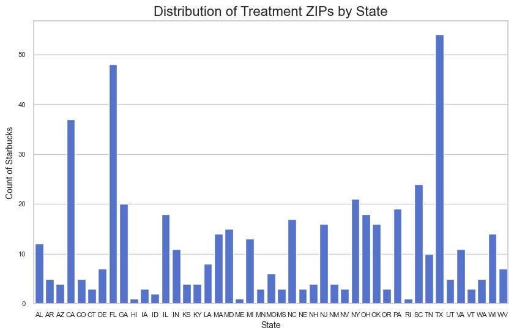  

7. Next, we assign pseudo first open years to all starbucks-free zips in the same proportion as they occur in the treatment zips lying in the merged Dataframe. The pseudo first open year enables the TWFE model to align treatment ZIPs with control ZIPs.  
```python
# Get the Dataframe of starbucks free zips
df_starbucks_free = df_all[df_all['starbucks_opened']==0].copy()

# Group the starbucks free zips by Postcode in their natural order
grouped_free = df_starbucks_free.groupby('Postcode', sort=False)

# Contains counts of each starbucks-free ZIP in df_all
starbucks_free_zip_counts = np.array(grouped_free.size())

# Get the actual starbucks free ZIP codes in that same order as the counts array
starbucks_free_zips = grouped_free.size().index.values

# Get the distribution of first_open years
starbucks_first_open_years = np.array(
    df_all[df_all['starbucks_opened']==1].groupby('Postcode')['first_open_year'].first())

# Choose as many random first open years as the number of Starbucks free zips, 
# by sampling the distribution in starbucks_first_open_years
np.random.seed(42)
pseudo_event_years = np.random.choice(a=starbucks_first_open_years, size=len(starbucks_free_zips), replace=True)

# Inflate elements in starbucks_first_open_years as many times as the corresponding count 
# in starbucks_free_zip_counts
starbucks_free_zip_pseudo_years = np.repeat(pseudo_event_years, starbucks_free_zip_counts)

df_all.loc[df_all['starbucks_opened'] == 0, 'first_open_year'] = starbucks_free_zip_pseudo_years

# Recalculate event_time for controls
df_all['event_time'] = df_all['Year'] - df_all['first_open_year']
```  

8. Add the prev_Xyr_avg_hpi_change columns  
```python
# Sort data by ZIP and Year
df_all = df_all.sort_values(by=['Postcode', 'Year'])

df_all['prev_5yr_avg_hpi_change'] = (
    df_all.groupby('Postcode')['HPI']
    .pct_change(periods=5, fill_method=None)
    .groupby(df_all['Postcode'])  # Ensure rolling is applied within each group
    .rolling(window=5, min_periods=1)
    .mean()
    .reset_index(level=0, drop=True)  # Reset index so it aligns with df_all
)
df_all['prev_4yr_avg_hpi_change'] = (
    df_all.groupby('Postcode')['HPI']
    .pct_change(periods=4, fill_method=None)
    .groupby(df_all['Postcode'])  # Ensure rolling is applied within each group
    .rolling(window=4, min_periods=1)
    .mean()
    .reset_index(level=0, drop=True)  # Reset index so it aligns with df_all
)
df_all['prev_3yr_avg_hpi_change'] = (
    df_all.groupby('Postcode')['HPI']
    .pct_change(periods=3, fill_method=None)
    .groupby(df_all['Postcode'])  # Ensure rolling is applied within each group
    .rolling(window=3, min_periods=1)
    .mean()
    .reset_index(level=0, drop=True)  # Reset index so it aligns with df_all
)
df_all['prev_2yr_avg_hpi_change'] = (
    df_all.groupby('Postcode')['HPI']
    .pct_change(periods=2, fill_method=None)
    .groupby(df_all['Postcode'])  # Ensure rolling is applied within each group
    .rolling(window=2, min_periods=1)
    .mean()
    .reset_index(level=0, drop=True)  # Reset index so it aligns with df_all
)
```  

9. Add the per capita Adjusted Gross Income (AGI) column.  

```python
# Read the AGI data into a Dataframe

# List to store processed data from each file
df_list = []

for year in range(12, 22+1):
    file_name = str(year) + 'zpallagi.csv'
    print('Processing ' + file_name)
 
    # Read the CSV
    df_agi = pd.read_csv(filepath_or_buffer=file_name, header=0)

    # Remove invalid ZIP codes (0 and 99999)
    df_agi = df_agi[(df_agi['zipcode'] > 0) & (df_agi['zipcode'] <= 99999)]

    # Convert ZIP codes to string (to match df_balanced)
    df_agi['Postcode'] = df_agi['zipcode'].astype(str).str.zfill(5)

    # Aggregate AGI and population for each ZIP and year
    df_agi_summary = df_agi.groupby(['Postcode']).agg(
        Total_AGI=('A00100', 'sum'),   # Total AGI
        Total_Rets=('N1', 'sum') # Total number of returns (proxy for population)
    ).reset_index()

    # Add Year column
    df_agi_summary['Year'] = 2000 + year

    # Append to list
    df_list.append(df_agi_summary)

# Combine all years into a single dataframe
df_agi_all = pd.concat(df_list, ignore_index=True)

# Ensure AGI is in actual dollars (convert from thousands)
df_agi_all['Total_AGI'] *= 1000

#Calculate the average AGI
df_agi_all['PC_AGI'] = np.round(df_agi_all['Total_AGI']/df_agi_all['Total_Rets'],2)

# Display the final structure
df_agi_all.head()

# Merge df_all with df_agi_all based on ZIP code and year
df_all_w_agi = df_all.merge(df_agi_all, 
                               left_on=['Postcode', 'Year'], 
                               right_on=['Postcode', 'Year'], 
                               how='left')
```

At this point, it's useful to reflect a bit on how we got here. Recall the sequence of dataframe joins that have occurred so far to get us to df_all_w_agi:
* df_zip_first_open_year (n=524) with df_hpi_filtered (n=648254) to get df_all (n=648254)
* df_all (n=648254) with df_agi_all (n=306295) to get df_all_w_agi (n=648254)  
```python
print(len(df_zip_first_open_year), len(df_hpi_filtered), len(df_all), len(df_agi_all), len(df_all_w_agi))
```  
```python
524 648254 648254 306295 648254
```  

10. Next, we need to create a matched set of control ZIPs using economic distance matching on the features 'PC_AGI' (a proxy for neighborhood affluence and a weak proxy for gentrification), and 'prev_2yr_avg_hpi_change', and 'prev_5yr_avg_hpi_change' (short-term and-long term pre-entry price momentum).  Since these measures are correlated, we'll use Mahalanobis distance as our distance matching metric.
```python
# Select relevant columns for score based matching (Uses MAHALANOBIS distance)
matching_features = ['PC_AGI', 'prev_2yr_avg_hpi_change', 'prev_5yr_avg_hpi_change']

# Drop all rows where the features to match have missing values
# df_matching will be used to draw the pool of treatment and matching control ZIPs
df_matching = df_all_w_agi.dropna(subset=matching_features)

# Fit a standard scaler to the matching_features vectors so that they can be standardized by
# removing the mean and scaling to unit variance.
scaler = StandardScaler()
# Note that df_matching[matching_features].values is an array of size (len(df_matching), len(matching_features)) i.e. (200597, 3)
scaler = scaler.fit(df_matching[matching_features].values)

# Extract the rows corresponding to ZIPs in which Starbucks opened in the Feb 2017 to Dec 2021 timeframe.
# Recall that this set of rows appear in df_matching as a result of the following sequence of Dataframe joins:
# df_zip_first_open_year with df_hpi_filtered to get df_all
# df_all with df_agi_all to get df_all_w_agi
df_treatment = df_matching[df_matching['starbucks_opened'] == 1].copy()

# Create a dataframe to store matched controls
df_matched_control = pd.DataFrame()

# Extract the set of unique treatment ZIPs from the set of treatment rows 
treatment_zips = df_treatment['Postcode'].unique()

# Create a pool of candidate control ZIPs
df_control_pool = df_matching[df_matching['starbucks_opened'] == 0].copy()

count = 1
# Loop over each treatment ZIP and find the best match
for zip_code in treatment_zips:
    # Get first_open_year of treatment ZIP
    first_open_year = df_treatment[df_treatment['Postcode'] == zip_code]['first_open_year'].iloc[0]
    match_year = first_open_year - 1  # Year before Starbucks opened

    # Extract treatment ZIP profile for that match_year
    treatment_profile = df_treatment[
        (df_treatment['Postcode'] == zip_code) & (df_treatment['Year'] == match_year)
        ][matching_features].values
    if len(treatment_profile) == 0:
        print(count,'/',len(treatment_zips),' ZIP=',zip_code,
            ' first_open_year=',first_open_year, ' treatment_profile=',treatment_profile,
            ' SKIPPING')
        continue

    standardized_treatment_profile = scaler.transform(treatment_profile)

    # Compute distance between treatment ZIP and all control ZIPs

    # Extract control ZIP profiles
    control_profiles = df_control_pool[matching_features].values

    standardized_control_profiles = scaler.transform(control_profiles)

    cov_matrix = np.cov(standardized_control_profiles.T)

    # Compute the inverse of the covariance matrix
    inv_cov_matrix = np.linalg.inv(cov_matrix)

    distances = cdist(standardized_treatment_profile, standardized_control_profiles,
        metric='mahalanobis', VI=inv_cov_matrix)

    # print(count,'/',len(treatment_zips),' ZIP=',zip_code,
    #     ' first_open_year=',first_open_year, ' treatment_profile=',treatment_profile,
    #     ' len(control_profiles)=',len(control_profiles),
    #     ' len(distances)=',len(distances[0]))

    # Find the best matching control ZIP
    best_match_idx = np.argmin(distances)
    best_match_zip = df_control_pool.iloc[best_match_idx]

    df_best_match_zip_rows = df_control_pool[df_control_pool['Postcode']==best_match_zip['Postcode']]

    # Append the best match to df_matched_control
    df_matched_control = pd.concat([df_matched_control, df_best_match_zip_rows])

    # Sort matched control ZIPs for consistency
    df_matched_control = df_matched_control.sort_values(by=['Postcode', 'Year'])

    # Remove the selected control ZIP from further consideration
    df_control_pool = df_control_pool[df_control_pool['Postcode'] != best_match_zip['Postcode']]

    count = count + 1

# Concatenate treatment and matched control ZIPs
df_balanced = pd.concat([df_treatment, df_matched_control], ignore_index=True)

df_balanced = df_balanced.astype({'Postcode': 'string', 'Year': 'int32', 'HPI': 'float64', 'starbucks_opened': 'int32', 'first_open_year': 'int32',
       'event_time': 'int32', 'prev_5yr_avg_hpi_change': 'float64', 'prev_4yr_avg_hpi_change': 'float64',
       'prev_3yr_avg_hpi_change': 'float64', 'prev_2yr_avg_hpi_change': 'float64'})

print('# df_treatment=',len(df_treatment))
print('# Unique ZIPs in df_treatment=',len(df_treatment['Postcode'].unique()))
print('# df_control_pool=',len(df_control_pool))
print('# Unique ZIPs in df_control_pool=',len(df_control_pool['Postcode'].unique()))
print('# df_matched_control=',len(df_matched_control))
print('# Unique ZIPs in df_matched_control=',len(df_matched_control['Postcode'].unique()))
```

You should see the following output:  
> \# df_treatment= 5570  
> \# Unique ZIPs in df_treatment= 508  
> \# df_control_pool= 189557  
> \# Unique ZIPs in df_control_pool= 17787  
> \# df_matched_control= 5470  
> \# Unique ZIPs in df_matched_control= 506  

The above matching procedure produces a balanced data frame with 508 treatment and 508 matched control ZIPs.  

A Violin plot of treatment and matched control groups illustrates the quality of the matching output:  
```python
# Violin plot of treatment and matched control groups demonstrates the high-quality matching we perform between treatment and control groups.
# This, to a large extent, allows us to make the claim that the parallel trends assumption will be obeyed by our data despite.
# E[log(HPI)_0_T_post​ − log(HPI)_0_T_pre​] = E[log(HPI)_0_C_post​ − log(HPI)_0_C_pre​]].
# Where, T = treatment group, C = Control group, post/pre = post/pre treatment, 0/1 = actually treated (received) / not treated (did not receive) Starbucks  
# In words: in the absence of treatment, the treated and control groups would have experienced the same average outcome trend over time.


# Combine treatment and matched control data for visualization
df_treatment_scaled = pd.DataFrame(
    scaler.transform(df_treatment[matching_features]), columns=matching_features)
df_treatment_scaled["Group"] = "Treatment"

df_matched_control_scaled = pd.DataFrame(
    scaler.transform(df_matched_control[matching_features]), columns=matching_features)
df_matched_control_scaled["Group"] = "Matched Control"

df_combined = pd.concat([df_treatment_scaled, df_matched_control_scaled])

# Convert to long format for seaborn
df_long = df_combined.melt(id_vars=["Group"], var_name="Economic Indicator", value_name="Standardized Value")

# Plot distributions to compare treatment and matched controls
plt.figure(figsize=(12, 6))
sns.violinplot(
    data=df_long,
    x="Economic Indicator",
    y="Standardized Value",
    hue="Group",
    split=True,          # requires exactly two hue levels
    inner="quartile",    # show quartiles inside each violin
    cut=0,               # (optional) don’t extend KDE beyond data
    density_norm="width"        # (optional) keep widths comparable
)
plt.title("Comparison of Standardized Matching Variables Between Treatment and Matched Controls")
plt.show()
```

You should be able to see the following plot:  


11. Next, we'll keep only the rows that fit within our event window (-5 to +5 years around each year of first entry 2017, 2018, 2019, 2020, and 2021)
```python
# Keep only the rows that fit within event window (e.g., -5 to +5 years around event)
df_balanced_5 = df_balanced[(df_balanced['event_time'] >= -5) & (df_balanced['event_time'] <= 5)]

# Create event time dummies correctly
event_time_dummies = pd.get_dummies(df_balanced_5['event_time'], drop_first=True, prefix='t').astype(int)

# Rename columns: Replace negative signs and ensure valid variable names
event_time_dummies.columns = [col.replace('-', 'm_').replace('t_', 't') for col in event_time_dummies.columns]

# Merge with the main dataset
df_balanced_5 = pd.concat([df_balanced_5, event_time_dummies], axis=1)

df_balanced_5['Postcode'] = df_balanced_5["Postcode"].astype('object')

print("Num years=",df_balanced_5['Year'].unique())

print("# treated ZIPs=",len(df_balanced_5[df_balanced_5['starbucks_opened']==0]['Postcode'].unique()), ", # matched control ZIPs=",len(df_balanced_5[df_balanced_5['starbucks_opened']==1]['Postcode'].unique()))
```  

Doing so yields a Dataframe with years spanning the timeframe [2012, 2022] containing 505 treatment ZIPs and 507 matched controls.

The training dataset is now ready.

## Training the TWFE event study model

The next step is to train the model. We use Statsmodels' OLS class for this purpose. We cluster the standard errors by ZIP code to account for serial correlation of residuals across the observation years (2012 to 2022) within each ZIP. Note that in our panel, each ZIP contributes multiple observations spanning the 2012 to 2022 timeframe. The HPI within a ZIP is often correlated from year to year due to hyper-local factors such as zoning changes, mass transit improvements etc. which affect only that ZIP. The clustering of errors at the ZIP level will account for this correlation and prevent the model from considering each year's HPI change as independent evidence. Thus, clustering at the ZIP level has the effect of "compressing" the panel (the effective number of observations available to the model is less than the raw row count). This increases the standard errors of the coefficients beyond what would have been their artificially depressed values without clustering.  

```python
# Build and train the regression model without and with the pre_trend_slope 

formula = "np.log(HPI) ~ " + " + ".join(event_time_dummies.columns) + " + PC_AGI + prev_2yr_avg_hpi_change + prev_5yr_avg_hpi_change + C(Year)"

model = ols(formula, data=df_balanced_5)

cluster_groups = df_balanced_5.loc[model.data.row_labels, 'Postcode']

model_results = model.fit(cov_type='cluster', cov_kwds={'groups': cluster_groups})

#model_results = model.fit(cov_type='HC1')

# Display results
print(model_results.summary())
```  

You should see the following training summary:  
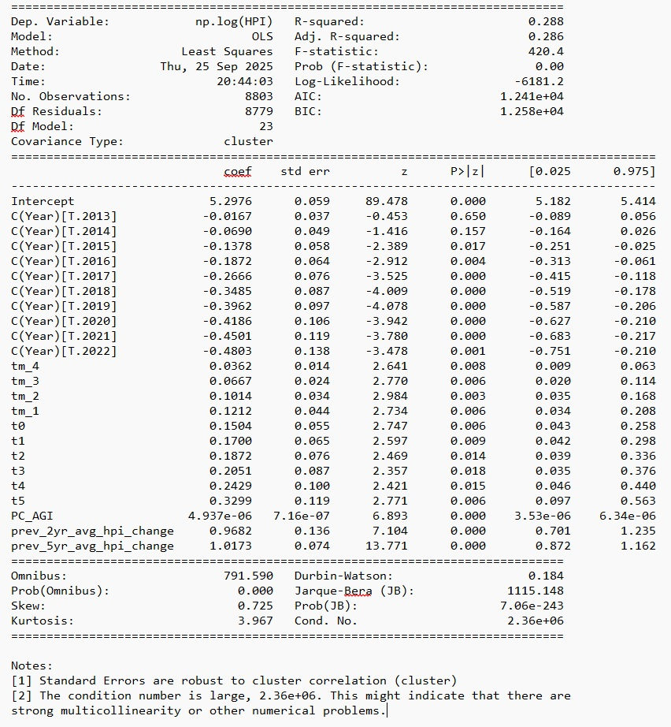

Notice that all pre- and post-entry event coefficients are statistically highly significant suggesting the plausibility of both reverse and forward causation at play. Having said that, partial-R² analysis indicates that the dominant factors are PC_AGI and price momentum:  

```python
# Perform Partial-R² analysis

# Full model formula
full_formula = "np.log(HPI) ~ " + " + ".join(event_time_dummies.columns) + \
               " + PC_AGI + prev_2yr_avg_hpi_change + prev_5yr_avg_hpi_change + C(Year)"

# Fit the full model
full_model_results = smf.ols(full_formula, data=df_balanced_5).fit()
full_r2 = full_model_results.rsquared_adj

# Variables to test for importance
variables_to_test = [
    'PC_AGI', 'prev_2yr_avg_hpi_change', 'prev_5yr_avg_hpi_change'
] + event_time_dummies.columns.tolist()

# Dictionary to store partial R²
partial_r2 = {}

# Loop through each variable and calculate the drop in R²
for var in tqdm(variables_to_test):
    print (var)
    reduced_vars = [v for v in variables_to_test if v != var]
    reduced_formula = "np.log(HPI) ~ " + " + ".join(reduced_vars) + " + C(Year)"
    print(reduced_formula)
    reduced_model_results = smf.ols(reduced_formula, data=df_balanced_5).fit()
    reduced_r2 = reduced_model_results.rsquared_adj
    partial_r2[var] = full_r2 - reduced_r2

print(partial_r2)

# Sort by importance
sorted_r2 = sorted(partial_r2.items(), key=lambda x: x[1], reverse=True)

print(sorted_r2)

# Display
df_importances = pd.DataFrame(sorted_r2, columns=['Variable', 'Partial_Adj_R2_Drop'])
print(df_importances)

# Set the style for the plot
sns.set_theme(style="whitegrid")

# Create the histogram
plt.figure(figsize=(10, 6))
sns.barplot(x=['PC_AGI', 'prev_5yr', 'prev_2yr', 'D(τ=5)', 'D(τ=4)', 'D(τ=3)', 'D(τ=2)', 'D(τ=1)', 'D(τ=0)', 'D(τ=-1)', 'D(τ=-2)', 'D(τ=-3)', 'D(τ=-4)'], y=df_importances['Partial_Adj_R2_Drop'], color="royalblue")

# Customize the plot
plt.xlabel("Variable", fontsize=10)
plt.ylabel("Drop in Adjusted R-squared", fontsize=10)
plt.title("Drop in Adjusted R-squared with the removal of each variable", fontsize=16)
plt.xticks(fontsize=10)
plt.yticks(fontsize=10)

# Display the plot
plt.show()
```  
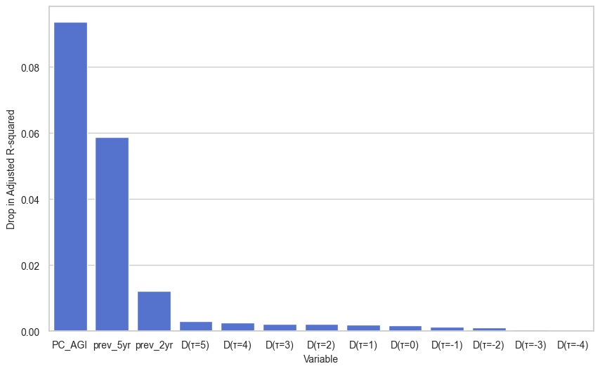  


We'll save the model output to a JSON file so that we can read it back in later to compare it with the results of the placebo study arm.  

```python
# Save model results to file

def save_model_results_to_json(model_results, filename):
    """Extracts relevant statistics and coefficients from model results and saves them to a JSON file."""
    
    # Extract model summary statistics
    summary_data = {
        "Dep. Variable": model_results.model.endog_names,
        "Model": "OLS",  # Explicitly stating the model type
        "Method": "Least Squares",
        "Date": datetime.datetime.now().strftime("%Y-%m-%d"),
        "Time": datetime.datetime.now().strftime("%H:%M:%S"),
        "N": int(model_results.nobs),
        "Df Residuals": int(model_results.df_resid),
        "Df Model": int(model_results.df_model),
        "Covariance Type": model_results.cov_type,
        "R-squared": model_results.rsquared,
        "Adj. R-squared": model_results.rsquared_adj,
        "F-statistic": model_results.fvalue if model_results.fvalue is not None else None,
        "Prob (F-statistic)": model_results.f_pvalue if model_results.f_pvalue is not None else None,
        "Log-Likelihood": model_results.llf,
        "AIC": model_results.aic,
        "BIC": model_results.bic,
        "Coefficients": {}
    }

    # Extract coefficients, standard errors, and confidence intervals
    coef_data = model_results.params
    std_err_data = model_results.bse
    conf_int_data = model_results.conf_int()

    for param in coef_data.index:
        summary_data["Coefficients"][param] = {
            "value": coef_data[param],
            "std_err": std_err_data[param],
            "conf_int_low": conf_int_data.loc[param, 0],
            "conf_int_high": conf_int_data.loc[param, 1]
        }

    # Write to JSON file
    with open(filename, "w") as json_file:
        json.dump(summary_data, json_file, indent=4)

    print(f"Model results saved to {filename}")


save_model_results_to_json(model_results, "real_study_results.json")
```  

## Training the placebo model
The data processing and training data creation steps for the placebo model are approximately the same as for the real model (both models being TWFE event study models with the same structural form). The significant departure from the real study's dataset creation procedure is that weconsider the full set of Starbuck-free control ZIPs as our candidate placebo pool. From this placebo pool, we random sample a subset of ZIPs of size same as number of real treatment ZIPs. We designate this subset as our synthetic treatment group by setting the starbucks_opened to 1, i.e. we simulate the entry of a Starbucks store in each of these pseudo-treatment ZIPs. Next, from the remaining subset of control ZIPs, we create an economic distance-matched set of controls using the same procedure as in the real study. Indeed, the rest of the training data set creation procedure is identical to that of the real study, and as is the training of the model itself. Following is the code to accomplish all of the above:  

```python
# We'll assume that you have finished building df_all using steps 1 through 8 in the Data pre-processing sub-section of the real study. You may execute the following print statements to verify that it has the correct data:
print('# df_all=',len(df_all))
print('# starbucks-free rows=',len(df_all[df_all['starbucks_opened']==0]))
print('# starbucks-free zips=',len(df_all[df_all['starbucks_opened']==0]['Postcode'].unique()))
print('# starbucks rows=',len(df_all[df_all['starbucks_opened']==1]))
print('# starbucks zips=',len(df_all[df_all['starbucks_opened']==1]['Postcode'].unique()))
print('# first_open_years=',len(df_all[df_all['first_open_year'].notna()]))

# Which should print the following output:
# # df_all= 648254
# # starbucks-free rows= 628083
# # starbucks-free zips= 18414
# # starbucks rows= 20171
# # starbucks zips= 510
# # first_open_years= 20171

# Randomly select a synthetic treatment group with the same size as the real treatment pool
# Randomly select a placebo ZIPs group with the same size as df_zip_first_open_year
#  (same as real treatment group)

# Get a copy of the starbucks-free ZIPs
df_placebo_pool = df_all[df_all['starbucks_opened']==0].copy()

num_treatment_zips = len(df_all[df_all['starbucks_opened']==1]['Postcode'].unique())
placebo_pool_zips = df_all[df_all['starbucks_opened']==0]['Postcode'].unique()

np.random.seed(42)
num_treatment_zips = len(df_all[df_all['starbucks_opened']==1]['Postcode'].unique())

placebo_treatment_zips = np.random.choice(placebo_pool_zips, size=num_treatment_zips, replace=False)

df_placebo_pool.loc[df_placebo_pool['Postcode'].isin(placebo_treatment_zips), 'starbucks_opened'] = 1

# Read the AGI data into a Dataframe

# List to store processed data from each file
df_list = []

for year in range(12, 22+1):
    file_name = str(year) + 'zpallagi.csv'
    print('Processing ' + file_name)
 
    # Read the CSV
    df_agi = pd.read_csv(filepath_or_buffer=file_name, header=0)

    # Remove invalid ZIP codes (0 and 99999)
    df_agi = df_agi[(df_agi['zipcode'] > 0) & (df_agi['zipcode'] <= 99999)]

    # Convert ZIP codes to string (to match df_balanced)
    df_agi['Postcode'] = df_agi['zipcode'].astype(str).str.zfill(5)

    # Aggregate AGI and population for each ZIP and year
    df_agi_summary = df_agi.groupby(['Postcode']).agg(
        Total_AGI=('A00100', 'sum'),   # Total AGI
        Total_Rets=('N1', 'sum') # Total number of returns (proxy for population)
    ).reset_index()

    # Add Year column
    df_agi_summary['Year'] = 2000 + year

    # Append to list
    df_list.append(df_agi_summary)

# Combine all years into a single dataframe
df_agi_all = pd.concat(df_list, ignore_index=True)

# Ensure AGI is in actual dollars (convert from thousands)
df_agi_all['Total_AGI'] *= 1000

#Calculate the average AGI
df_agi_all['PC_AGI'] = np.round(df_agi_all['Total_AGI']/df_agi_all['Total_Rets'],2)

# Display the final structure
df_agi_all.head()

# Merge df_placebo_pool with df_agi_all based on ZIP code and year
df_all_w_agi = df_placebo_pool.merge(df_agi_all, 
                               left_on=['Postcode', 'Year'], 
                               right_on=['Postcode', 'Year'], 
                               how='left')

# Select relevant columns for score based matching (Uses MAHALANOBIS distance)
matching_features = ['PC_AGI', 'prev_2yr_avg_hpi_change', 'prev_5yr_avg_hpi_change']

# Drop missing values (in case of edge cases)
df_matching = df_all_w_agi.dropna(subset=matching_features)

# Fit a standard scaler to the matching_features vectors so that they can be standardized by
# removing the mean and scaling to unit variance.
scaler = StandardScaler()
scaler = scaler.fit(df_matching[matching_features].values)

# Extract relevant treatment ZIP data
df_treatment = df_matching[df_matching['starbucks_opened'] == 1].copy()

# Create a dataframe to store matched controls
df_matched_control = pd.DataFrame()

# Extract unique treatment ZIPs
treatment_zips = df_treatment['Postcode'].unique()

# Create a pool of candidate control ZIPs
df_control_pool = df_matching[df_matching['starbucks_opened'] == 0].copy()

count = 1
# Loop over each treatment ZIP and find the best match
for zip_code in treatment_zips:
    # Get first_open_year of treatment ZIP
    first_open_year = df_treatment[df_treatment['Postcode'] == zip_code]['first_open_year'].iloc[0]
    match_year = first_open_year - 1  # Year before Starbucks opened

    # Extract treatment ZIP profile for that match_year
    treatment_profile = df_treatment[
        (df_treatment['Postcode'] == zip_code) & (df_treatment['Year'] == match_year)
        ][matching_features].values
    if len(treatment_profile) == 0:
        print(count,'/',len(treatment_zips),' ZIP=',zip_code,
            ' first_open_year=',first_open_year, ' treatment_profile=',treatment_profile,
            ' SKIPPING')
        continue

    standardized_treatment_profile = scaler.transform(treatment_profile)

    # Compute distance between treatment ZIP and all control ZIPs

    # Extract control ZIP profiles
    control_profiles = df_control_pool[matching_features].values

    standardized_control_profiles = scaler.transform(control_profiles)

    cov_matrix = np.cov(standardized_control_profiles.T)

    # Compute the inverse of the covariance matrix
    inv_cov_matrix = np.linalg.inv(cov_matrix)

    distances = cdist(standardized_treatment_profile, standardized_control_profiles,
        metric='mahalanobis', VI=inv_cov_matrix)

    # print(count,'/',len(treatment_zips),' ZIP=',zip_code,
    #     ' first_open_year=',first_open_year, ' treatment_profile=',treatment_profile,
    #     ' len(control_profiles)=',len(control_profiles),
    #     ' len(distances)=',len(distances[0]))

    # Find the best matching control ZIP
    best_match_idx = np.argmin(distances)
    best_match_zip = df_control_pool.iloc[best_match_idx]

    df_best_match_zip_rows = df_control_pool[df_control_pool['Postcode']==best_match_zip['Postcode']]

    # Append the best match to df_matched_control
    df_matched_control = pd.concat([df_matched_control, df_best_match_zip_rows])

    # Sort matched control ZIPs for consistency
    df_matched_control = df_matched_control.sort_values(by=['Postcode', 'Year'])

    # Remove the selected control ZIP from further consideration
    df_control_pool = df_control_pool[df_control_pool['Postcode'] != best_match_zip['Postcode']]

    count = count + 1

# Concatenate treatment and matched control ZIPs
df_balanced = pd.concat([df_treatment, df_matched_control], ignore_index=True)

df_balanced = df_balanced.astype({'Postcode': 'string', 'Year': 'int32', 'HPI': 'float64', 'starbucks_opened': 'int32', 'first_open_year': 'int32',
       'event_time': 'int32', 'prev_5yr_avg_hpi_change': 'float64', 'prev_4yr_avg_hpi_change': 'float64',
       'prev_3yr_avg_hpi_change': 'float64', 'prev_2yr_avg_hpi_change': 'float64'})

print('# df_treatment=',len(df_treatment))
print('# Unique ZIPs in df_treatment=',len(df_treatment['Postcode'].unique()))
print('# df_control_pool=',len(df_control_pool))
print('# Unique ZIPs in df_control_pool=',len(df_control_pool['Postcode'].unique()))
print('# df_matched_control=',len(df_matched_control))
print('# Unique ZIPs in df_matched_control=',len(df_matched_control['Postcode'].unique()))

# Keep only event window (e.g., -5 to +5 years around event)
df_balanced_5 = df_balanced[(df_balanced['event_time'] >= -5) & (df_balanced['event_time'] <= 5)]

# Create event time dummies correctly
event_time_dummies = pd.get_dummies(df_balanced_5['event_time'], drop_first=True, prefix='t').astype(int)

# Rename columns: Replace negative signs and ensure valid variable names
event_time_dummies.columns = [col.replace('-', 'm_').replace('t_', 't') for col in event_time_dummies.columns]

# Merge with the main dataset
df_balanced_5 = pd.concat([df_balanced_5, event_time_dummies], axis=1)

df_balanced_5['Postcode'] = df_balanced_5['Postcode'].astype('object')

print("Num years=",df_balanced_5['Year'].unique())

print("# treated ZIPs=",len(df_balanced_5[df_balanced_5['starbucks_opened']==0]['Postcode'].unique()), ", # matched control ZIPs=",len(df_balanced_5[df_balanced_5['starbucks_opened']==1]['Postcode'].unique()))

# Build and train the regression model on the PLACEBO dataset

# With pre_trend_slope
formula = "np.log(HPI) ~ " + " + ".join(event_time_dummies.columns) + " + PC_AGI + prev_2yr_avg_hpi_change + prev_5yr_avg_hpi_change + C(Year)"

# Run the regression
model = ols(formula, data=df_balanced_5)

cluster_groups = df_balanced_5.loc[model.data.row_labels, 'Postcode']

model_results = model.fit(cov_type='cluster', cov_kwds={'groups': cluster_groups})

#model_results = model.fit(cov_type='HC1')

# Display results
print(model_results.summary())

```  

A quick F-test confirms the joint-zero hypothesis for the pre-trends, which is one way to look at the **parallel trends assumption** in a TWFE setting. 

```python
# Implement a joint F-test on the pre=entry coefficients for tm_4, tm_3, tm_2, and tm_1.

hypotheses = 'tm_4 = tm_3 = tm_2 = tm_1 = 0'
f_test = model_results.f_test(hypotheses)
print(f_test)

```

You will see the following kind of training output. What's starkly evident in the output is that **all event time coefficients $\beta_{\tau}$ for $\tau$ = -4 t +5 have lost signnificance**. This is exactly the result one would expect if Starbucks entry and house price growth _are_ correlated.  

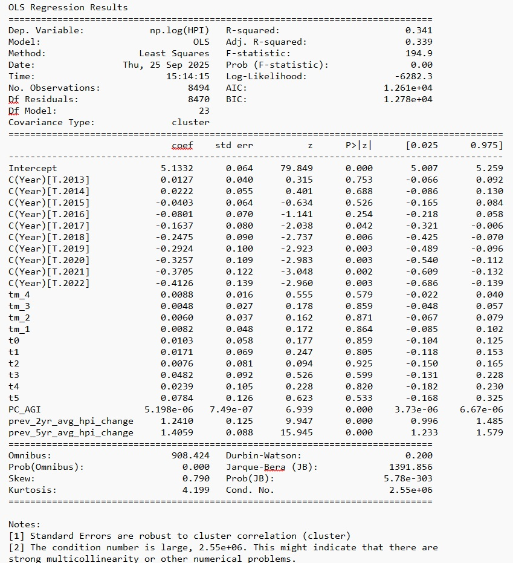  

Let's save this model's results also to a JSON file:  

```python
# Save model results to file

def save_model_results_to_json(model_results, filename):
    """Extracts relevant statistics and coefficients from model results and saves them to a JSON file."""
    
    # Extract model summary statistics
    summary_data = {
        "Dep. Variable": model_results.model.endog_names,
        "Model": "OLS",  # Explicitly stating the model type
        "Method": "Least Squares",
        "Date": datetime.datetime.now().strftime("%Y-%m-%d"),
        "Time": datetime.datetime.now().strftime("%H:%M:%S"),
        "N": int(model_results.nobs),
        "Df Residuals": int(model_results.df_resid),
        "Df Model": int(model_results.df_model),
        "Covariance Type": model_results.cov_type,
        "R-squared": model_results.rsquared,
        "Adj. R-squared": model_results.rsquared_adj,
        "F-statistic": model_results.fvalue if model_results.fvalue is not None else None,
        "Prob (F-statistic)": model_results.f_pvalue if model_results.f_pvalue is not None else None,
        "Log-Likelihood": model_results.llf,
        "AIC": model_results.aic,
        "BIC": model_results.bic,
        "Coefficients": {}
    }

    # Extract coefficients, standard errors, and confidence intervals
    coef_data = model_results.params
    std_err_data = model_results.bse
    conf_int_data = model_results.conf_int()

    for param in coef_data.index:
        summary_data["Coefficients"][param] = {
            "value": coef_data[param],
            "std_err": std_err_data[param],
            "conf_int_low": conf_int_data.loc[param, 0],
            "conf_int_high": conf_int_data.loc[param, 1]
        }

    # Write to JSON file
    with open(filename, "w") as json_file:
        json.dump(summary_data, json_file, indent=4)

    print(f"Model results saved to {filename}")


save_model_results_to_json(model_results, "placebo_study_results.json")

```  

Finally, let's visualize a comparison of the coefficients from the real and placebo studies:  

```python
# Visualize a comparison of the coefficients from the real and placebo studies

# Reads JSON file and extracts coefficients and confidence intervals for event-time dummies.
def load_coefficients(filename):
    with open(filename, "r") as file:
        data = json.load(file)

    # Extract coefficients for event-time dummies only (tm_4 to t_5)
    event_times = ["tm_4", "tm_3", "tm_2", "tm_1", "t0", "t1", "t2", "t3", "t4", "t5"]
    coefs = [data["Coefficients"][t]["value"] for t in event_times]
    conf_low = [data["Coefficients"][t]["conf_int_low"] for t in event_times]
    conf_high = [data["Coefficients"][t]["conf_int_high"] for t in event_times]

    return np.array(event_times), np.array(coefs), np.array(conf_low), np.array(conf_high)

# Plots event-study coefficients for real and placebo tests.
def plot_event_study(real_study_file, placebo_file):
    
    # Load real study coefficients
    event_times, coefs_real, conf_low_real, conf_high_real = load_coefficients(real_study_file)
    
    # Load placebo study coefficients
    _, coefs_placebo, conf_low_placebo, conf_high_placebo = load_coefficients(placebo_file)

    # Convert event times for plotting (x-axis)
    event_numbers = np.arange(len(event_times))

    # Plot Real Study
    plt.figure(figsize=(8, 5))
    
    plt.plot(event_numbers, coefs_real, marker='o', linestyle='-', color='royalblue', label="Real Study")
    plt.fill_between(event_numbers, conf_low_real, conf_high_real, color='royalblue', alpha=0.2)

    # Plot Placebo Study
    plt.plot(event_numbers, coefs_placebo, marker='s', linestyle='--', color='r', label="Placebo Study")
    plt.fill_between(event_numbers, conf_low_placebo, conf_high_placebo, color='r', alpha=0.2)

    # Mark the Starbucks Entry Event
    plt.axvline(4, color='k', linestyle='--', linewidth=1)
    plt.text(4, max(conf_high_real) * 0.9, "Starbucks Entry", 
            horizontalalignment='center', verticalalignment='bottom', fontsize=10, color='black', fontweight='bold')

    # Formatting
    plt.axhline(0, color="black", linestyle="--", linewidth=1)
    plt.xticks(event_numbers, list(range(-4, 6)))
    plt.xlabel("Event Time")
    plt.ylabel("Coefficient Estimate")
    #plt.title("Event Study Coefficients: Real vs. Placebo")
    plt.legend()
    plt.grid(True, linestyle="--", alpha=0.6)

    plt.show()

# Example usage
real_study_results_file = "real_study_results.json"
placebo_study_results_file = "placebo_study_results.json"

plot_event_study(real_study_results_file, placebo_study_results_file)

```  

You would see the following plot indicating a clear divergence between the real and placebo coefficients in both the pre- and the post-entry portions of the curve. As mentioned earlier, the confidence intervals are wide during clustering at the ZIP level in both the real and placebo models.  

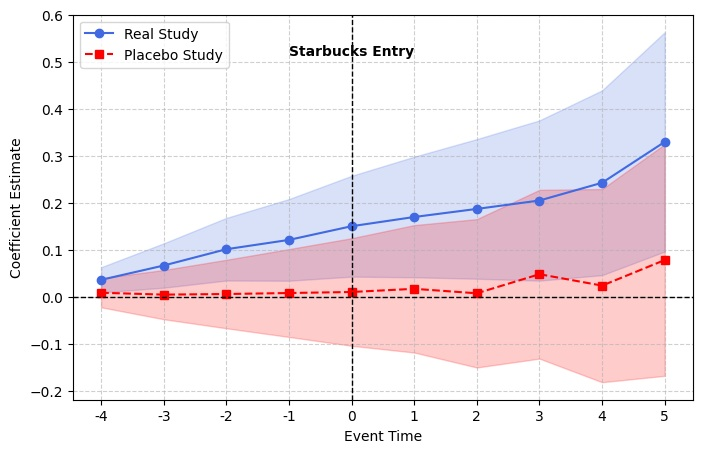  

## Anticipation
Anticipation occurs when to-be-treated units start experiencing treatment effects "in anticipation of" treatment occuring, usually close to the treatment time. A study such as ours that explicitly studies reverse causation is particularly sensitive to anticipation as there is no good means to study and discount violation of parallel trends outside of a placebo setting. In our case, neighborhoods in which Starbucks makes a first time entry could, anticipation of such an entry, start becoming costlier than the matched controls, especially close to the entry year.  
While such anticipation is a plausible in theory, if you look closely at the pre-entry trend of event time coeffcients, anticipation seems highly unlikely in our data set. The ZIPs that eventually receive Starbucks start growing faster much before Starbucks' entry. Still we can easily confirm our judgement by performing a progressive **donut**. We'll repeatedly test for joint zero-ness of pre-trend coefficients (using a Wald test) and associated pre-trend slope by progressively removing the pre-trends at $\tau$ = -1, -2, -3.  
```python
# Parse tau for names like: tm_4, tm_3, tm_2, tm_1, t0, t1, ... t5
def _parse_tau(colname: str) -> int:
    s = colname.strip().lower()
    if s.startswith("tm_"):        # negative taus, e.g. tm_3 -> -3
        return -int(s.split("tm_")[1])
    if s.startswith("t"):          # nonnegative taus, e.g. t4 -> 4, t0 -> 0
        return int(s[1:])
    raise ValueError(f"Unexpected event-time name: {colname}")

def _log_to_pct(x):  # for convenience in the table
    return 100.0 * (np.exp(x) - 1.0)

# Progressive 'anticipation' donuts on TWFE leads.
# Returns a DataFrame with mean pre (log & %), Wald χ² stat and p-value.
# Assumes event-time columns are named like: tm_4, tm_3, tm_2, tm_1, t0, t1, ..., t5
def twfe_pre_donut_tests(model_results, event_time_dummies, drop_sizes=(1,2,3)):
    # Order event-time coefficients by τ
    tau_cols = list(event_time_dummies.columns)
    taus = pd.Index([_parse_tau(c) for c in tau_cols], name="tau")
    order = np.argsort(taus.values)
    taus = taus[order]
    tau_cols = [tau_cols[i] for i in order]

    # Pull cluster-robust estimates & covariance for the event-time dummies
    beta = model_results.params.loc[tau_cols].to_numpy()
    Sigma = model_results.cov_params().loc[tau_cols, tau_cols].to_numpy()

    pre_all = [t for t in taus if t < 0]  # leads only
    if len(pre_all) == 0:
        raise ValueError("No pre-treatment (lead) coefficients found among tm_*.")

    rows = []
    for k in drop_sizes:
        drop = set(range(-k, 0))   # {-1}, {-2,-1}, {-3,-2,-1}
        keep = [t for t in pre_all if t not in drop]
        if not keep:
            continue

        idx = [list(taus).index(t) for t in keep]
        theta = beta[idx]
        V = Sigma[np.ix_(idx, idx)]

        mean_log = float(theta.mean())
        mean_pct = _log_to_pct(mean_log)

        W = float(theta.T @ pinv(V) @ theta)
        p = float(1 - chi2.cdf(W, df=len(idx)))

        rows.append({
            "drop_k": k,
            "kept_taus": keep,
            "mean_pre_log": mean_log,
            "mean_pre_%": mean_pct,
            "Wald_chi2": W,
            "df": len(idx),
            "p_value": p
        })

    return pd.DataFrame(rows)

twfe_donuts = twfe_pre_donut_tests(model_results, event_time_dummies, drop_sizes=(1,2,3))
print(twfe_donuts.to_string(index=False,
      formatters={"mean_pre_log": "{:.4f}".format,
                  "mean_pre_%": "{:.2f}".format,
                  "Wald_chi2": "{:.2f}".format,
                  "p_value": "{:.3g}".format}))

```  

You should see the following output:  

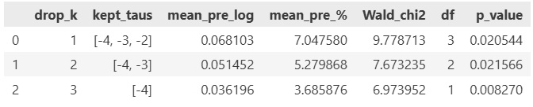

All p-values are much less than 0.05. H0 (zero pre-trend coefficients) is strongly rejected after dropping the coefficients at $\tau$= -1, [-1, -2], and [-1, -2, -3]. So we reject the possibility that anticipation is the only reason house prices increase beyond matched controls in neighborhoods that eventually receive a Starbuck entry.  


## Why are ZIP FEs left out of the TWFE model?

Why not add ZIP FEs to the TWFE model? Our intuition says that we should leave them out. Given the shortness of the panel, adding thousands of ZIP FEs will soak up all the inter-ZIP variance leaving precious little for the event coefficients.  

It will also inflate the variance associated with the coefficient estimates making them less precise.  

A better alternative to ZIP FEs is the PC_AGI covariate which we expect to capture much of the "personality" of a ZIP especially in the way that it affects house price growth that the ZIP FE might have otherwise represented in a longer panel.  

**At any rate, leaving out area FEs in a TWFE is an unconventional choice. So we need to be clear on why we want to do it.**  

For starters, let's try training the model by adding ZIP FEs to see what happens.  
```python
formula = "np.log(HPI) ~ " + " + ".join(event_time_dummies.columns) + " + PC_AGI + prev_2yr_avg_hpi_change + prev_5yr_avg_hpi_change + C(Year) + C(Postcode)"

model = ols(formula, data=df_balanced_5)

cluster_groups = df_balanced_5.loc[model.data.row_labels, 'Postcode']

model_results = model.fit(cov_type='cluster', cov_kwds={'groups': cluster_groups})

#model_results = model.fit(cov_type='HC1')

# Display results
print(model_results.summary())
```   

The training output is too big to show inline but you can access it here: [!link]  

Leaving out all covariates and considering only the year and the ZIP FEs and the event dummies will also produce the same sort of result.  
```python
formula = "np.log(HPI) ~ " + " + ".join(event_time_dummies.columns) + " + C(Year) + C(Postcode)"

model = ols(formula, data=df_balanced_5)

cluster_groups = df_balanced_5.loc[model.data.row_labels, 'Postcode']

model_results = model.fit(cov_type='cluster', cov_kwds={'groups': cluster_groups})

#model_results = model.fit(cov_type='HC1')

# Display results
print(model_results.summary())
```  

Here's the [!link] to the training output.  

In both cases, notice the following about the above result:  
* **R² explosion (0.288 --> 0.995)**:  As expected the ZIP FEs soak up all the variance leaving only the intra-ZIP over-time variance to be measured by the event time dummies. _But that's not what we want these dummies to measure!_
* **Event-time coefficients flip sign from positive to negative**: Does this mean Starbucks preferentially seeks out neighborhoods with a nagative house price trend? That doesn't make sense. At any rate, we shouldn't read too much into the flipped signs as most of the inter-ZIP variance is already captured by the ZIP FEs, and the event coefficients are probably measuring changes with respect to their respective mean price level instead of with respect to the controls. 
* **Very tiny eigenvalue / singularity warning, and rank deficiency**: Notice the **BIG RED FLAGS** waved by Statsmodels in the Notes section of the output and also warning about rank deficiency. The almost zero eigenvalue implies that the X matrix (the regressors) are almost perfectly colinear. They are almost perfect linear combinations of other regressors. The rank warning confirms this. Out of the 1000+ regressors we added, only 20 or so were found to be independent. In such a circumstance, the X'X matrix that is at the heart of the OLS estimator ((X′X)^(−1)X′y) is basically non-invertible).  

In plain words, this is a terrible model.  

The solution lies in the insight that a neighborhood (a ZIP) projects a certain "personality" that is multi-facted. Different facets of this personality come in to play in determining (directly or indirectly) the attractiveness of neighborhood and thereby, the house price. Important facets such as neighboorhood affluence, gentrification, and historical price momentum can be presumed to be strong determiners of house price growth. Given the problems we saw with ZIP FEs, we instead included PC_AGI and the historical 2 year and 5 year price momentum variables as covariates.  
 
We can run some (indirect) tests to validate the suitability of these covariates for capturing much of the price variance that ZIP FEs would have otherwise capatured:  

**VIF analysis**  
This is R² of covariates on ZIP FEs and Year FEs. It tells us how much of the variance of covariates is explained by the FEs, particularly the ZIP FEs.  
If R^2 is very high when X = C(Postcode), then C(Postcode) explains much of the cross-sectional variance in the covariates. It soaks up the same signal covariates carry, and adding it will inevitably inflate standard errors and destabilize event coefficients in a short panel such as ours.  

**Two-way demeaning then VIF on continuous covariates**
1. Two-way demean each continuous regressor (and, possibly, each event dummy) by ZIP and by Year
2. Build a matrix with the de-meaned continuous regressors only (e.g., PC_AGI, prev_2yr, prev_5yr).
3. Compute standard VIFs on this residualized X to answer the question:  
   How collinear are these covariates with each other after the FE information is absorbed?  
   If they’re high, it confirms collinearity even in the within space;  
   If they’re modest-to-low, it shows the main collinearity was between the covariates and the FE.  

**Finally, and just for sanity's sake, also analyze within vs between SD of covariates**  

So, here's the code for doing these tests:  

```python
for var in ["PC_AGI", "prev_2yr_avg_hpi_change", "prev_5yr_avg_hpi_change"]:
    m = smf.ols(f"{var} ~ C(Postcode)", data=df_balanced_5).fit()
    print(var, "R^2 =", round(m.rsquared, 3))

print("\n")

def tw_demean(s, g_zip, g_year):
    return s - s.groupby(g_zip).transform('mean') - s.groupby(g_year).transform('mean') + s.mean()

Z = pd.DataFrame({
    "PC_AGI_dm": tw_demean(df_balanced_5["PC_AGI"], df_balanced_5["Postcode"], df_balanced_5["Year"]),
    "p2_dm": tw_demean(df_balanced_5["prev_2yr_avg_hpi_change"], df_balanced_5["Postcode"], df_balanced_5["Year"]),
    "p5_dm": tw_demean(df_balanced_5["prev_5yr_avg_hpi_change"], df_balanced_5["Postcode"], df_balanced_5["Year"]),
})
Z = Z.dropna()

vifs = []
for i, col in enumerate(Z.columns):
    vifs.append((col, variance_inflation_factor(Z.values, i)))
print(vifs)

print("\n")

def within_sd(s, g):
    return np.std(s - s.groupby(g).transform('mean'), ddof=1)
def between_sd(s, g):
    return np.std(s.groupby(g).transform('mean'), ddof=1)

for var in ["PC_AGI", "prev_2yr_avg_hpi_change", "prev_5yr_avg_hpi_change"]:
    w = within_sd(df_balanced_5[var], df_balanced_5["Postcode"])
    b = between_sd(df_balanced_5[var], df_balanced_5["Postcode"])
    print(var, "within_sd=", round(w,3), "between_sd=", round(b,3), "within/between=", round(w/b,3))
```  
When you run it, you should see the following output:  
> PC_AGI R^2 = **0.89**  
> prev_2yr_avg_hpi_change R^2 = 0.32  
> prev_5yr_avg_hpi_change R^2 = 0.283  
>   
>   
> [('PC_AGI_dm', np.float64(**1.0041985001116154**)), ('p2_dm', np.float64(**1.007933651874741**)), ('p5_dm', np.float64(**1.005230075128041**))]  
>   
>   
> PC_AGI within_sd= 12234.427 between_sd= 34865.15 within/between= **0.351**  
> prev_2yr_avg_hpi_change within_sd= 0.077 between_sd= 0.053 within/between= 1.456  
> prev_5yr_avg_hpi_change within_sd= 0.185 between_sd= 0.116 within/between= 1.593  

We see two things very clearly from the above tests:  
1. The variance in PC_AGI (which we assume to be a proxy of neighborhood afluence and gentrification) is very strongly correlated with ZIP FEs, and an overwhelming fraction of it (as would be expected) is cross-sectional.
2. Among the covariates, there is essentially no collinearity left after you partial out the fixed effect elements.  

These results, in our opinion, make our preferred set of covariates (and especially PC_AGI) a strong substitute for ZIP FEs, especially given the serious structural issues we encountered after adding ZIP FEs to our panel.  

## Validation of the TWFE event study's findings in the face of commonly expressed concerns about the TWFE model
TWFE deployed in a staggered treatment setting is susceptible to generating biased (often depressed) estimates for the $\beta_{\tau}$ event time coefficients when there is **cohort-level heterogeneity**. In our case, a cohort (g) consists of all ZIPs treated in a certain year such as 2017 or 2018. For each event time $\tau$ such as $\tau$=+2 (2 years after entry), if different cohorts express a different degree of house price rise relative to controls, then we have the classic cohort-level heterogeneity situation. In this case, for each value of $\tau$ (and because TWFE considers already-treated cohorts as controls for the treated cohort), the TWFE event study will effectively (one might say, erroneously) calculate a weighted average of  the effect across all cohorts. This can bias down the event time coefficients estimated by the TWFE.  

Interestingly, in our data, we actually expect there to be heterogeneity of event time effects across the cohorts 2017 through 2021. There are two straightforward reasons for this expectation:
1. Recall that our data panel is truncated (censored) at 2022. So the later cohorts (g=2020, 2021) have hardly enough to zero data points available to generate the full signal for $\tau$ > +2
2. The macro-shocks associated with COVID19 during 2020 and 2021 may have changed the store opening dynamics and dampened café-adjacent price effects.  

At any rate, let's examine cohort-level heterogeneity. To do so, we'll take inspiration from the Goodman-Bacon (2021) decomposition of the TWFE into cohort-wise 2x2 DiD models. We'll plot both the **cohort-wise ATT (Average Treatment Effect on Treated)(g)** and the **cohort-wise trend of the ATT(g) across event times $\tau$ = -4 through +5**.  
```python
# Examine cohort-level heterogeneity. To do so, we'll take inspiration from the Goodman-Bacon (2021) decomposition of the TWFE into cohort-wise 2x2 DiD models.
# We'll plot both the cohort-wise ATT (Average Treatment Effect on Treated)(g) and the cohort-wise trend of the ATT(g) across event times τ = -4 through +5.

# The following is simply the code that generates a balanced training panel that we saw earlier, except that this version builds it for a single cohort like for only g=2020
def generate_balanced_panel(df_all_w_agi_by_year):

    # Select relevant columns for score based matching (Uses MAHALANOBIS distance)
    matching_features = ['PC_AGI', 'prev_2yr_avg_hpi_change', 'prev_5yr_avg_hpi_change']

    # Drop all rows where the features to match have missing values
    # df_matching will be used to draw the pool of treatment and matching control ZIPs
    df_matching = df_all_w_agi_by_year.dropna(subset=matching_features)
    #print('len(df_matching)=',len(df_matching))

    # Fit a standard scaler to the matching_features vectors so that they can be standardized by
    # removing the mean and scaling to unit variance.
    scaler = StandardScaler()
    # Note that df_matching[matching_features].values is an array of size (len(df_matching), len(matching_features)) i.e. (200597, 3)
    scaler = scaler.fit(df_matching[matching_features].values)

    # Extract the rows corresponding to ZIPs in which Starbucks opened in the Feb 2017 to Dec 2021 timeframe.
    # Recall that this set of rows appear in df_matching as a result of the following sequence of Dataframe joins:
    # df_zip_first_open_year with df_hpi_filtered to get df_all
    # df_all with df_agi_all to get df_all_w_agi_by_year
    df_treatment = df_matching[df_matching['starbucks_opened'] == 1].copy()
    #print('len(df_treatment)=',len(df_treatment))

    # Create a dataframe to store matched controls
    df_matched_control = pd.DataFrame()

    # Extract the set of unique treatment ZIPs from the set of treatment rows 
    treatment_zips = df_treatment['Postcode'].unique()
    #print('len(treatment_zips)=',len(treatment_zips))

    # Create a pool of candidate control ZIPs
    df_control_pool = df_matching[df_matching['starbucks_opened'] == 0].copy()
    #print('len(df_control_pool)=',len(df_control_pool))

    count = 1
    # Loop over each treatment ZIP and find the best match
    for zip_code in treatment_zips:
        # Get first_open_year of treatment ZIP
        first_open_year = df_treatment[df_treatment['Postcode'] == zip_code]['first_open_year'].iloc[0]
        match_year = first_open_year - 1  # Year before Starbucks opened

        # Extract treatment ZIP profile for that match_year
        treatment_profile = df_treatment[
            (df_treatment['Postcode'] == zip_code) & (df_treatment['Year'] == match_year)
            ][matching_features].values

        if len(treatment_profile) == 0:
            print(count,'/',len(treatment_zips),' ZIP=',zip_code,
                ' first_open_year=',first_open_year, ' treatment_profile=',treatment_profile,
                ' SKIPPING')
            continue

        standardized_treatment_profile = scaler.transform(treatment_profile)

        # Compute distance between treatment ZIP and all control ZIPs

        # Extract control ZIP profiles
        control_profiles = df_control_pool[matching_features].values
        if len(control_profiles) == 0:
            print(count,'/',len(treatment_zips),' ZIP=',zip_code,
                ' first_open_year=',first_open_year, ' treatment_profile=',treatment_profile,
                'len(control_profiles)=',len(control_profiles), ' SKIPPING')
            continue

        standardized_control_profiles = scaler.transform(control_profiles)

        cov_matrix = np.cov(standardized_control_profiles.T)

        # Compute the inverse of the covariance matrix
        inv_cov_matrix = np.linalg.inv(cov_matrix)

        distances = cdist(standardized_treatment_profile, standardized_control_profiles,
            metric='mahalanobis', VI=inv_cov_matrix)

        # print(count,'/',len(treatment_zips),' ZIP=',zip_code,
        #     ' first_open_year=',first_open_year, ' treatment_profile=',treatment_profile,
        #     ' len(control_profiles)=',len(control_profiles),
        #     ' len(distances)=',len(distances[0]))

        # Find the best matching control ZIP
        best_match_idx = np.argmin(distances)
        best_match_zip = df_control_pool.iloc[best_match_idx]

        df_best_match_zip_rows = df_control_pool[df_control_pool['Postcode']==best_match_zip['Postcode']]

        # Append the best match to df_matched_control
        df_matched_control = pd.concat([df_matched_control, df_best_match_zip_rows])

        # Sort matched control ZIPs for consistency
        df_matched_control = df_matched_control.sort_values(by=['Postcode', 'Year'])

        # Remove the selected control ZIP from further consideration
        df_control_pool = df_control_pool[df_control_pool['Postcode'] != best_match_zip['Postcode']]

        count = count + 1

    # Step 4: Concatenate treatment and matched control ZIPs
    df_balanced = pd.concat([df_treatment, df_matched_control], ignore_index=True)

    df_balanced = df_balanced.astype({'Postcode': 'string', 'Year': 'int32', 'HPI': 'float64', 'starbucks_opened': 'int32', 'first_open_year': 'int32',
        'event_time': 'int32', 'prev_5yr_avg_hpi_change': 'float64', 'prev_4yr_avg_hpi_change': 'float64',
        'prev_3yr_avg_hpi_change': 'float64', 'prev_2yr_avg_hpi_change': 'float64'})
    
    #print("len(df_balanced)=",len(df_balanced))
    #print("len(df_matched_control)=",len(df_matched_control))
    #print("len(control_zips)=",len(df_matched_control['Postcode'].unique()))
    return df_balanced

rows  = []
cols = ["g", "term", "coef", "std_err", "p_value", "ci_low", "ci_high", "pct_eff", "pct_ci_low", "pct_ci_high", "nobs", "df_model", "df_resid"]

df_all_w_agi["first_open_year"].unique()
for g in np.sort(a=df_all_w_agi["first_open_year"].unique()):
    print("g = ",g)
    gg = int(g)
    treatment_effect_ind = "D_" + str(gg)
    df_all_w_agi_by_year = df_all_w_agi[(df_all_w_agi["first_open_year"] == gg)]
    df_balanced_5_by_year = generate_balanced_panel(df_all_w_agi_by_year)
    df_treatment_by_year = df_balanced_5_by_year[df_balanced_5_by_year["starbucks_opened"] == 1]
    df_matched_control_by_year = df_balanced_5_by_year[df_balanced_5_by_year["starbucks_opened"] == 0]

    # Keep only event window (e.g., -5 to +5 years around event)
    df_balanced_5_by_year = df_balanced_5_by_year[(df_balanced_5_by_year['event_time'] >= -5) & (df_balanced_5_by_year['event_time'] <= 5)]

    # create D_it
    df_balanced_5_by_year[treatment_effect_ind] = np.where(
        (df_balanced_5_by_year["starbucks_opened"] == 1) &
        (df_balanced_5_by_year["first_open_year"] == gg) & 
        (df_balanced_5_by_year["Year"] >= gg),
        1, 
        0
    )

    # Create event time dummies correctly
    event_time_dummies = pd.get_dummies(df_balanced_5_by_year['event_time'], drop_first=True, prefix='t').astype(int)

    # Rename columns: Replace negative signs and ensure valid variable names
    event_time_dummies.columns = [col.replace('-', 'm_').replace('t_', 't') for col in event_time_dummies.columns]

    # Merge with the main dataset
    df_balanced_5_by_year = pd.concat([df_balanced_5_by_year, event_time_dummies], axis=1)

    df_balanced_5_by_year['Postcode'] = df_balanced_5_by_year["Postcode"].astype('object')

    formula = "np.log(HPI) ~ C(Year) + " + treatment_effect_ind + " + PC_AGI + prev_2yr_avg_hpi_change + prev_5yr_avg_hpi_change"

    model = ols(formula, data=df_balanced_5_by_year)

    cluster_groups = df_balanced_5_by_year.loc[model.data.row_labels, 'Postcode']

    model_results = model.fit(cov_type='cluster', cov_kwds={'groups': cluster_groups})

    # Extract stats for the D_g term (may be dropped if collinear)
    if treatment_effect_ind in model_results.params.index:
        coef = model_results.params[treatment_effect_ind]
        se = model_results.bse[treatment_effect_ind]
        pval = model_results.pvalues[treatment_effect_ind]
        ci_low, ci_high = model_results.conf_int(alpha=0.05).loc[treatment_effect_ind]
    else:
        coef = se = pval = ci_low = ci_high = np.nan

    row = {
        "g": g,
        "term": treatment_effect_ind,
        "coef": coef,
        "std_err": se,
        "p_value": pval,
        "ci_low": ci_low,
        "ci_high": ci_high,
        "nobs": int(model_results.nobs),
        "df_model": model_results.df_model,
        "df_resid": model_results.df_resid,
    }

    # Transform log-point effects to percent: 100*(exp(beta)-1)
    for k_in, k_out_lo, k_out_hi in [("coef","pct_eff","pct_ci_low"), ("ci_low","pct_ci_low","pct_ci_low"), ("ci_high","pct_ci_high","pct_ci_high")]:
        pass  # (placeholder to keep logic tidy)

    row["pct_eff"] = 100.0 * (np.exp(coef) - 1.0) if pd.notnull(coef) else np.nan
    row["pct_ci_low"] = 100.0 * (np.exp(ci_low) - 1.0) if pd.notnull(ci_low) else np.nan
    row["pct_ci_high"] = 100.0 * (np.exp(ci_high) - 1.0) if pd.notnull(ci_high) else np.nan

    rows.append(row)

df_results = pd.DataFrame(rows, columns=cols)

print(df_results)

# Plot 𝜏_g with CIs (bar chart by entry year) to highlight the heterogeneity across cohorts.

x = np.arange(len(df_results))
y = df_results["pct_eff"].values
err_lower = y - df_results["pct_ci_low"].values
err_upper = df_results["pct_ci_high"].values - y
yerr = np.vstack([err_lower, err_upper])

plt.figure(figsize=(8,5))
plt.errorbar(x, y, yerr=yerr, fmt="o", color="black", capsize=5, elinewidth=1.5)
plt.axhline(0, color="grey", ls="--", lw=1)
plt.xticks(x, df_results["g"].astype(int))
plt.gca().yaxis.set_major_formatter(PercentFormatter(100))
plt.ylabel("Estimated effect (%)")
plt.title(r"Cohort-specific $\tau_g$ with 95% CIs")
plt.tight_layout();
plt.show()

# Perform cohort-specific decomposition of the event time coefficients 

def parse_tau_from_col(col):
    # 'tm_5' -> -5; 't0' -> 0; 't3' -> 3
    if col.startswith("tm_"):
        return -int(col.split("tm_")[1])
    elif col.startswith("t"):
        return int(col.split("t")[1])
    raise ValueError(f"Unrecognized event-dummy name: {col}")

rows_entry_year_cohorts = []
cols_entry_year_cohorts = ["g", "D_g", "tau_g", "std_err", "p_value", "ci_low", "ci_high", "pct_eff", "pct_ci_low", "pct_ci_high", "nobs", "df_model", "df_resid"]

rows_evt_time_cohorts  = []
cols_evt_time_cohorts = ["g", "event_time", "term", "beta", "std_err", "p_value", "ci_low", "ci_high", "pct_eff", "pct_ci_low", "pct_ci_high", "nobs", "df_model", "df_resid"]

df_all_w_agi["first_open_year"].unique()
for g in np.sort(a=df_all_w_agi["first_open_year"].unique()):
    print("g = ",g)
    gg = int(g)
    treatment_effect_ind = "D_" + str(gg)
    df_all_w_agi_by_year = df_all_w_agi[(df_all_w_agi["first_open_year"] == gg)]
    df_balanced_5_by_year = generate_balanced_panel(df_all_w_agi_by_year)
    df_treatment_by_year = df_balanced_5_by_year[df_balanced_5_by_year["starbucks_opened"] == 1]
    df_matched_control_by_year = df_balanced_5_by_year[df_balanced_5_by_year["starbucks_opened"] == 0]

    # Keep only event window (e.g., -5 to +5 years around event)
    df_balanced_5_by_year = df_balanced_5_by_year[(df_balanced_5_by_year['event_time'] >= -5) & (df_balanced_5_by_year['event_time'] <= 5)]

    # create D_it
    df_balanced_5_by_year[treatment_effect_ind] = np.where(
        (df_balanced_5_by_year["starbucks_opened"] == 1) &
        (df_balanced_5_by_year["first_open_year"] == gg) & 
        (df_balanced_5_by_year["Year"] >= gg),
        1, 
        0
    )

    # Create event time dummies correctly
    event_time_dummies = pd.get_dummies(df_balanced_5_by_year['event_time'], drop_first=True, prefix='t').astype(int)

    # Rename columns: Replace negative signs and ensure valid variable names
    event_time_dummies.columns = [col.replace('-', 'm_').replace('t_', 't') for col in event_time_dummies.columns]

    for event_time_dummy_name in event_time_dummies.columns:
        interaction_effect_ind = "Int_" + event_time_dummy_name
        df_balanced_5_by_year[interaction_effect_ind] = df_balanced_5_by_year["starbucks_opened"]*event_time_dummies[event_time_dummy_name]
    
    # DON'T Merge with the main dataset
    # df_balanced_5_by_year = pd.concat([df_balanced_5_by_year, event_time_dummies], axis=1)

    df_balanced_5_by_year['Postcode'] = df_balanced_5_by_year["Postcode"].astype('object')

    int_terms = " + ".join([f"Int_{c}" for c in event_time_dummies.columns])

    evt_time_cohort_formula = f"np.log(HPI) ~ C(Year) + {int_terms}" + " + PC_AGI + prev_2yr_avg_hpi_change + prev_5yr_avg_hpi_change"
    print(evt_time_cohort_formula)

    # Build the model
    evt_time_cohort_model = ols(evt_time_cohort_formula, data=df_balanced_5_by_year)

    # Align to the estimation sample (patsy may drop NA rows)
    idx = evt_time_cohort_model.data.row_labels
    zip_labels = df_balanced_5_by_year.loc[idx, "Postcode"]

    # Factorize to contiguous integer codes 0..G-1
    groups_codes, _ = pd.factorize(zip_labels, sort=False)
    # If there could be missing labels (NaN), replace -1 with a new code
    if (groups_codes < 0).any():
        groups_codes = np.where(groups_codes < 0, groups_codes.max() + 1, groups_codes)

    # Sanity checks
    assert groups_codes.ndim == 1
    assert groups_codes.shape[0] == len(evt_time_cohort_model.endog)

    # Fit with clustered SE
    evt_time_cohort_model_results = evt_time_cohort_model.fit(
        cov_type="cluster",
        cov_kwds={"groups": groups_codes}
    )

    # Collect coefficients for each interaction, map back to event_time
    ci = evt_time_cohort_model_results.conf_int()
    for c in event_time_dummies.columns:
        term = f"Int_{c}"
        if term in evt_time_cohort_model_results.params.index:
            beta = evt_time_cohort_model_results.params[term]
            se = evt_time_cohort_model_results.bse[term]
            p = evt_time_cohort_model_results.pvalues[term]
            lo, hi = ci.loc[term]
            tau = parse_tau_from_col(c)  # numeric event time

            rows_evt_time_cohorts.append({
                "g": g,
                "event_time": tau,
                "term": term,
                "beta": beta,
                "std_err": se,
                "p_value": p,
                "ci_low": lo,
                "ci_high": hi,
                "pct_eff": 100.0 * (np.exp(beta) - 1.0),
                "pct_ci_low": 100.0 * (np.exp(lo) - 1.0),
                "pct_ci_high": 100.0 * (np.exp(hi) - 1.0),
                "nobs": int(evt_time_cohort_model_results.nobs),
                "df_model": evt_time_cohort_model_results.df_model,
                "df_resid": evt_time_cohort_model_results.df_resid,
            })

    entry_year_cohort_formula = "np.log(HPI) ~ C(Year) + " + treatment_effect_ind + " + PC_AGI + prev_2yr_avg_hpi_change + prev_5yr_avg_hpi_change"

    model = ols(entry_year_cohort_formula, data=df_balanced_5_by_year)

    cluster_groups = df_balanced_5_by_year.loc[model.data.row_labels, 'Postcode']

    entry_year_cohort_model_results = model.fit(cov_type='cluster', cov_kwds={'groups': cluster_groups})

    # Extract stats for the D_g term (may be dropped if collinear)
    if treatment_effect_ind in entry_year_cohort_model_results.params.index:
        coef = entry_year_cohort_model_results.params[treatment_effect_ind]
        se = entry_year_cohort_model_results.bse[treatment_effect_ind]
        pval = entry_year_cohort_model_results.pvalues[treatment_effect_ind]
        ci_low, ci_high = entry_year_cohort_model_results.conf_int(alpha=0.05).loc[treatment_effect_ind]
    else:
        coef = se = pval = ci_low = ci_high = np.nan

    row = {
        "g": g,
        "D_g": treatment_effect_ind,
        "tau_g": coef,
        "std_err": se,
        "p_value": pval,
        "ci_low": ci_low,
        "ci_high": ci_high,
        "nobs": int(entry_year_cohort_model_results.nobs),
        "df_model": entry_year_cohort_model_results.df_model,
        "df_resid": entry_year_cohort_model_results.df_resid,
    }

    row["pct_eff"] = 100.0 * (np.exp(coef) - 1.0) if pd.notnull(coef) else np.nan
    row["pct_ci_low"] = 100.0 * (np.exp(ci_low) - 1.0) if pd.notnull(ci_low) else np.nan
    row["pct_ci_high"] = 100.0 * (np.exp(ci_high) - 1.0) if pd.notnull(ci_high) else np.nan

    rows_entry_year_cohorts.append(row)

df_results_evt_time_cohorts = pd.DataFrame(rows_evt_time_cohorts, columns=cols_evt_time_cohorts)
df_results_entry_year_cohorts = pd.DataFrame(rows_entry_year_cohorts, columns=cols_entry_year_cohorts)

print(df_results_evt_time_cohorts)
print(df_results_entry_year_cohorts)

# Next, construct the plot for 𝛽𝜏,𝑔 for each g, and τ = -4 to +5, baseline τ = −5
def facet_event_study(tidy_es, baseline_tau=-5, ncols=2, figsize_per_panel=(6,3.2)):
    cohorts = sorted(tidy_es["g"].unique())
    n = len(cohorts)
    nrows = math.ceil(n / ncols)
    fig, axes = plt.subplots(nrows, ncols, figsize=(figsize_per_panel[0]*ncols,
                                                    figsize_per_panel[1]*nrows),
                             sharex=True, sharey=True)
    axes = np.array(axes).reshape(nrows, ncols)

    # global x range
    xticks = sorted(tidy_es["event_time"].unique())
    for k, g in enumerate(cohorts):
        ax = axes[k // ncols, k % ncols]
        d = tidy_es[tidy_es["g"] == g].sort_values("event_time")
        x = d["event_time"].to_numpy()
        y = d["pct_eff"].to_numpy()
        yerr = np.vstack([y - d["pct_ci_low"].to_numpy(),
                          d["pct_ci_high"].to_numpy() - y])

        ax.errorbar(x, y, yerr=yerr, fmt="o-", capsize=4, linewidth=1.2, markersize=4, color="black")
        ax.axhline(0, color="grey", ls="--", lw=1)

        # mark the omitted baseline τ = -5 for reference
        ax.axvline(baseline_tau, color="grey", ls=":", lw=1)
        ax.text(baseline_tau, ax.get_ylim()[1]*0.9, f"Baseline τ={baseline_tau}",
                ha="center", va="top", fontsize=8, color="grey")

        ax.set_title(f"Cohort {int(g)}", fontsize=11)
        ax.yaxis.set_major_formatter(PercentFormatter(100))
        ax.grid(alpha=0.15)

    # remove any empty panels
    for k in range(n, nrows*ncols):
        fig.delaxes(axes[k // ncols, k % ncols])

    # labels
    fig.suptitle("Cohort-specific event-study estimates (95% CIs)", y=0.98, fontsize=13)
    for ax in axes[-1, :]:
        if ax in axes:
            ax.set_xlabel("Event time (years since entry)")
    for r in range(nrows):
        axes[r,0].set_ylabel("Effect (% vs baseline)")

    plt.tight_layout(rect=[0,0,1,0.96])
    plt.show()

facet_event_study(df_results_evt_time_cohorts, baseline_tau=-5, ncols=2)
```  

When you run the above massive chunk of code, you should see the following two plots:  

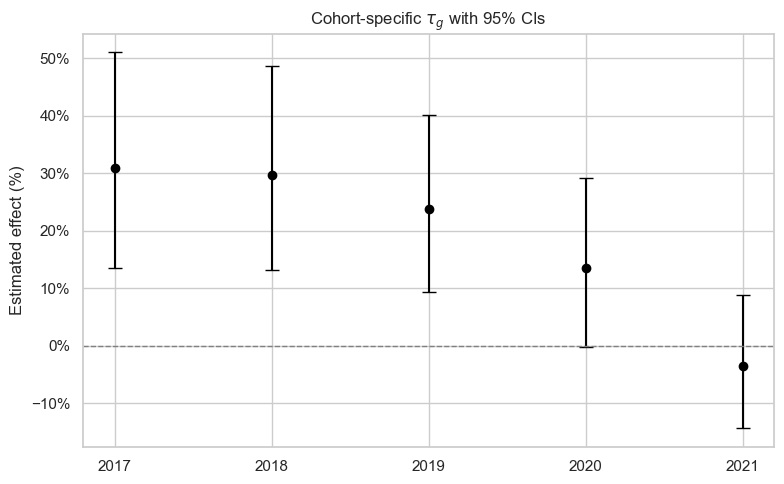  
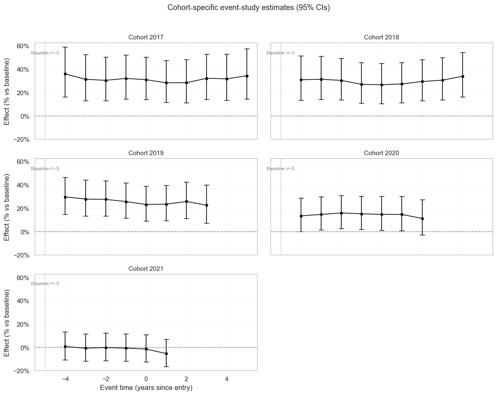

Both plots show exactly the cohort level differences in ATT that we were expecting to see. The second plot (cohort-wise trend of the ATT(g) across event times $\tau$ = -4 through +5), is where the real action is:  
* The effect for the earlier cohorts (g=2017, 2018, 2019) is strongly positive and more-or-less steady in the 20%-40% range across the full range of $\tau$. This is indeed very encouraging and, in our opinion, sufficient justification of plasibility of both the forward and reverse effect.
* The effect for g=2020 is smaller (around 20%) but still strongly positive.
* The effect for g=2021 is really more noise than valid effect.  

Recall that the TWFE reported a strong, steady pre-entry growth trend relative to controls from 3.7% at ($\tau$ = -4) to 12.9% at ($\tau$ = -1), and an equally strong post-entry trend relative to controls from 16% at entry ($\tau$ = 0) to 39% five years later ($\tau$ = +5). This is sort of easy to explain for at least for the post-entry part of the observed trend. At $\tau$ = 0 and 1, all treated cohorts are in the weighted average (including the weak late cohorts). The weighted mean is biased down but still keeps growing due to the strong early cohorts. As $\tau$ increases, late cohorts drop out (they don’t have data for $\tau$=+2,+3,+4,+5 yet), so the TWFE computes $\beta_{\tau}$ from earlier cohorts which are stronger causing the weighted mean to rise further.  

## Cross-validating the results using the Borusyak–Jaravel–Spiess (BJS) model

The results from our TWFE event study have largely survived fine-grained scrutiny.
 - **Strong pre- and post-entry trends**: Both the pre- and post-entry trned in the event coefficients $\beta_{\tau}$ have been strongly positive and rising suggesting a strong plausibility of both reverse (pre-entry) and forward (post-entry) causation.  
 - **Clearcut placebo-based vindication**: Placebo results (statistically insignificant pre- and post-trends under fake treatment) showed that the pre- and post-entry effects were not driven purely by non-Starbucks covariates, omitted variables, and model structure.
 - **Anticipation not a concern**: The strong multi-year rising pre-entry trend indicates that anticipation, if present, was not only driver of pre-entry house price growth in treated ZIPs. The progressive donut analysis of pre-trends validated this judgement.
  - **Cohort-level heterogenity present but explainable, and not a concern**: Cohort-wise analysis of trends yielded patterns that could be tied back to the shape of the overall trend curve reported by the TWFE event model. If at all, it validated our judgement that the event coefficients reported by the TWFE event study are likely to be biased down.

It's okay to stop at this point, but we will still perform one final validation. We'll run a quick regression using using the BJS (2021) model which does not consider Already Treated units as controls and thereby walks around the control group contamination experienced by the TWFE in a staggered entry setting such as ours.  

The following code builds and trains a BJS model on the Starbucks dataset, performs Wald test on the pre-entry trends (including on the pre-entry trend donut), builds both the point-wise 95% C.I. (like we did in the TWFE), as well as building a uniform band, constructs a linear line on the pre-entry trends to estimate how the post-entry trend compares with this slope, and displays everything in a nice chart and an accomplying table.  

```python
# BJS (2021) robustness with FAST cluster bootstrap (no refits)
# - Absorbs ZIP & Year FE via PanelOLS; falls back to Year-FE-only if needed.
# - τ window: [-5,5]; years: 2012..YEAR_MAX (currently 2022, but change to a later date like 2027 if you get a fresh dataset from FHFA in the next few years)
# - Outputs ATT(τ), CIs/p-values, joint pretrend test, and a percent-scale plot.

YEAR_MAX = 2022
TAU_MIN, TAU_MAX = -5, 5
TAU_WINDOW = list(range(TAU_MIN, TAU_MAX + 1))
N_BOOT = 499  # speed versus accuracy knob; use 0 to skip bootstrap entirely
SEED = 123
PLOT_UNIFORM_BAND = True

def log_to_pct(x):
    return 100.0 * (np.exp(x) - 1.0)

def clean_panel(df, year_max, tau_min, tau_max):
    df = df.copy()
    df = df.query("2012 <= Year <= @year_max and @tau_min <= event_time <= @tau_max").copy()
    df["Postcode"] = df["Postcode"].astype(str)
    df["Year"] = df["Year"].astype(int)
    df["logHPI"] = np.log(df["HPI"])
    df["treated"] = (df["starbucks_opened"] == 1)
    df["treated_period"] = df["treated"] & (df["Year"] >= df["first_open_year"])
    df["tau"] = np.where(df["treated"], df["event_time"], np.nan)
    return df.set_index(["Postcode","Year"]).sort_index()

def fit_predict_counterfactual_panelols(df_panel):
    from linearmodels.panel import PanelOLS
    df_u = df_panel.loc[~df_panel["treated_period"]].copy()
    # 0 treated-period rows in the training sample
    assert not df_u["treated_period"].any()

    # counts
    print("Obs used to fit untreated model:", len(df_u))
    print("Obs used for ATT (treated rows):", df_panel.loc[df_panel["treated"]].shape[0])

    df_u["__const"] = 1.0
    with warnings.catch_warnings():
        warnings.simplefilter("ignore")  # suppress MissingValueWarning noise
        res = PanelOLS(df_u["logHPI"], df_u[["__const"]],
                       entity_effects=True, time_effects=True,
                       drop_absorbed=True).fit(cov_type="clustered",
                                               cluster_entity=True)
    df_panel = df_panel.copy()
    df_panel["__const"] = 1.0
    try:
        pred = res.predict(exog=df_panel[["__const"]])  # newer linearmodels
    except TypeError:
        pred = res.predict(df_panel[["__const"]])       # older signature
    df_panel["yhat_no_treat"] = (pred.predictions if hasattr(pred,"predictions")
                                 else pd.Series(np.asarray(pred).ravel(), index=df_panel.index))
    return df_panel

def fit_predict_counterfactual_yearfe(df_panel):
    import statsmodels.formula.api as smf
    df_sm = df_panel.reset_index().copy()
    m = smf.ols("logHPI ~ C(Year)", data=df_sm.loc[~df_sm["treated_period"]]).fit()
    df_sm["yhat_no_treat"] = m.predict(df_sm)
    return df_sm.set_index(["Postcode","Year"])

def fit_predict_counterfactual(df_raw, year_max=YEAR_MAX, tau_min=TAU_MIN, tau_max=TAU_MAX):
    df_panel = clean_panel(df_raw, year_max, tau_min, tau_max)

    # Try PanelOLS; only fall back if the package is missing
    try:
        from linearmodels.panel import PanelOLS  # noqa: F401
        have_panelols = True
    except ImportError:
        have_panelols = False

    if have_panelols:
        df_hat = fit_predict_counterfactual_panelols(df_panel)  # <- uses ZIP+Year FE
        used_panelols = True
    else:
        print("[WARN] Year-FE fallback (install 'linearmodels' for ZIP+Year FE).")
        df_hat = fit_predict_counterfactual_yearfe(df_panel)
        used_panelols = False

    att = df_hat.loc[df_hat["treated"], ["tau","treated_period","logHPI","yhat_no_treat"]].copy()
    att = att.join(df_hat[["treated"]], how="left").reset_index()  # keep Postcode for clustering
    att["att"] = att["logHPI"] - att["yhat_no_treat"]
    return att, used_panelols

def summarize_att_tau(att, tau_window=TAU_WINDOW):
    return (att.loc[att["tau"].isin(tau_window)]
               .groupby("tau")["att"].mean()
               .reindex(tau_window))

def overall_post_effect(att):
    return att.loc[att["treated_period"], "att"].mean()

def overall_post_effect_donut(att, drop_taus={-1,0,1}):
    mask = att["treated_period"] & (~att["tau"].isin(drop_taus))
    return att.loc[mask, "att"].mean()

# Performs a FAST cluster bootstrap (no refits)
# Reuses fitted counterfactuals; we resample clusters (ZIPs) and recompute aggregated ATT(τ).
def fast_cluster_bootstrap_from_predictions(att, B=N_BOOT, seed=SEED, tau_window=TAU_WINDOW):
    if B <= 0:
        return None
    rng = np.random.default_rng(seed)
    att_tau = att.loc[att["tau"].isin(tau_window)].copy()

    # Precompute per-cluster sums and counts at each τ
    g = (att_tau.groupby(["Postcode","tau"])["att"]
         .agg(["sum","count"]).rename(columns={"sum":"s","count":"n"}).reset_index())
    # Pivot to matrices for speed: rows=clusters, cols=taus
    clusters = g["Postcode"].astype(str).unique()
    taus = tau_window
    s_mat = pd.DataFrame(0.0, index=clusters, columns=taus)
    n_mat = pd.DataFrame(0.0, index=clusters, columns=taus)
    for _, row in g.iterrows():
        s_mat.at[str(row["Postcode"]), int(row["tau"])] = row["s"]
        n_mat.at[str(row["Postcode"]), int(row["tau"])] = row["n"]

    boot = np.empty((B, len(taus)), dtype=float)
    for b in range(B):
        draw = rng.choice(clusters, size=len(clusters), replace=True)
        # multiplicity (how many times each cluster was picked)
        # using value_counts is fine; or use np.add.at with integer ids
        w = pd.Series(draw).value_counts()
        # Weighted sums across drawn clusters
        S = (s_mat.reindex(w.index).multiply(w, axis=0)).sum(axis=0).values
        N = (n_mat.reindex(w.index).multiply(w, axis=0)).sum(axis=0).values
        boot[b, :] = np.divide(S, N, out=np.zeros_like(S), where=(N>0))

    return pd.DataFrame(boot, columns=taus)

def att_table_with_uncertainty(att_tau, boot_df):
    idx = att_tau.index
    if boot_df is None:
        return pd.DataFrame({"ATT_log":att_tau.values, "SE":np.nan,
                             "CI_lo":np.nan, "CI_hi":np.nan, "p":np.nan}, index=idx)
    se = boot_df.std(axis=0, ddof=1).reindex(idx)
    z = att_tau / se
    from scipy.stats import norm
    p = 2*(1 - norm.cdf(np.abs(z)))
    ci_lo = att_tau - 1.96*se
    ci_hi = att_tau + 1.96*se
    out = pd.DataFrame({"ATT_log":att_tau, "SE":se, "CI_lo":ci_lo, "CI_hi":ci_hi, "p":p})
    out["ATT_pct"] = log_to_pct(out["ATT_log"])
    out["CI_lo_pct"] = log_to_pct(out["CI_lo"])
    out["CI_hi_pct"] = log_to_pct(out["CI_hi"])
    return out

def uniform_band(att_tau, boot_df):
    if boot_df is None:
        return None, None
    idx = att_tau.index
    se = boot_df.std(axis=0, ddof=1).reindex(idx).replace(0.0, np.nan)
    t_boot = (boot_df.subtract(att_tau, axis=1)).divide(se, axis=1)
    c95 = t_boot.abs().max(axis=1).quantile(0.95)
    uni_lo = att_tau - c95*se
    uni_hi = att_tau + c95*se
    return uni_lo, uni_hi

def joint_pretrend_test(att_tau, boot_df, pre_taus=(-4,-3,-2,-1)):
    from numpy.linalg import pinv
    from scipy.stats import chi2
    theta = att_tau.loc[list(pre_taus)].to_numpy()
    if boot_df is None or np.any(~np.isfinite(theta)):
        return {"W": np.nan, "df": len(pre_taus), "p_asym": np.nan, "p_boot": np.nan}
    boot_pre = boot_df.loc[:, list(pre_taus)].to_numpy()
    boot_centered = boot_pre - theta
    Sigma = np.cov(boot_centered, rowvar=False)
    W = float(theta.T @ pinv(Sigma) @ theta)
    p_asym = 1 - chi2.cdf(W, df=len(pre_taus))
    Qb = np.einsum('bi,ij,bj->b', boot_centered, pinv(Sigma), boot_centered)
    p_boot = float(np.mean(Qb >= W))
    return {"W": W, "df": len(pre_taus), "p_asym": p_asym, "p_boot": p_boot}

def bjs_pre_donut_tests(att_tau, boot_df, drop_sizes=(1,2,3)):
    pre_full = [-5,-4,-3,-2,-1]
    rows = []
    for k in drop_sizes:
        drop = set(range(-k,0))                 # {−1,..,−k}
        keep = [t for t in pre_full if t not in drop]
        theta = att_tau.loc[keep].to_numpy()
        mean_log = float(theta.mean()); mean_pct = log_to_pct(mean_log)

        if boot_df is not None:
            boot_keep = boot_df.loc[:, keep].to_numpy()
            boot_centered = boot_keep - theta
            Sigma = np.cov(boot_centered, rowvar=False)
            W = float(theta.T @ pinv(Sigma) @ theta)
            Qb = np.einsum('bi,ij,bj->b', boot_centered, pinv(Sigma), boot_centered)
            p_boot = float(np.mean(Qb >= W))
            taus = np.asarray(keep, dtype=float)
            X = np.column_stack([np.ones_like(taus), taus])
            beta = lstsq(X, theta, rcond=None)[0]; slope_log = float(beta[1])
            slopes = np.array([lstsq(X, boot_keep[b,:], rcond=None)[0][1] for b in range(boot_keep.shape[0])])
            se_slope = slopes.std(ddof=1)
            z = slope_log / se_slope; p_slope = 2*(1 - norm.cdf(abs(z)))
            ci_lo_log = slope_log - 1.96*se_slope; ci_hi_log = slope_log + 1.96*se_slope
        else:
            W = p_boot = np.nan
            taus = np.asarray(keep, dtype=float)
            X = np.column_stack([np.ones_like(taus), taus])
            slope_log = float(lstsq(X, theta, rcond=None)[0][1])
            p_slope = ci_lo_log = ci_hi_log = np.nan

        rows.append({
            "k": k, "keep": keep,
            "mean_pre_%": round(mean_pct, 2),
            "Wald_p": p_boot,
            "slope_%/τ": round(log_to_pct(slope_log), 2),
            "slope_CI_lo_%": None if np.isnan(ci_lo_log) else round(log_to_pct(ci_lo_log), 2),
            "slope_CI_hi_%": None if np.isnan(ci_hi_log) else round(log_to_pct(ci_hi_log), 2),
        })
    return pd.DataFrame(rows)

def make_presentation_figure(att_tau, boot_df, overall_post_log, overall_post_donut_log,
                             pre_drop_sizes=(1,2,3), show_uniform=True):
    # Uncertainty + uniform band
    att_tab = att_table_with_uncertainty(att_tau, boot_df)
    uni = uniform_band(att_tau, boot_df) if show_uniform else (None, None)

    # Pre-trend fit on τ ∈ [-5,-1]
    pre_idx = [-5,-4,-3,-2,-1]
    slope, intercept = np.polyfit(pre_idx, att_tau.loc[pre_idx].values, 1)
    taus = att_tau.index.values
    baseline = intercept + slope*taus   # continuation of pre-trend

    # Pre-only donut summary table
    pre_tbl = bjs_pre_donut_tests(att_tau, boot_df, drop_sizes=pre_drop_sizes)

    # Figure layout
    from matplotlib.gridspec import GridSpec
    fig = plt.figure(figsize=(10, 6.4))
    gs = GridSpec(3, 1, height_ratios=[3.0, 0.25, 1.25], hspace=0.25)
    ax = fig.add_subplot(gs[0, 0])

    # Main plot: ATT% with CI + uniform band + pre-trend continuation
    x = att_tab.index.values
    ax.fill_between(x, att_tab["CI_lo_pct"], att_tab["CI_hi_pct"], alpha=0.20, label="95% CI")
    if uni[0] is not None:
        ax.fill_between(x, log_to_pct(uni[0]), log_to_pct(uni[1]), alpha=0.12, label="Uniform 95% band")
    ax.plot(x, att_tab["ATT_pct"], marker="o", linewidth=1.8, label="ATT(τ) %")
    ax.plot(x, log_to_pct(pd.Series(baseline, index=att_tab.index)), linestyle="--", linewidth=1.2, label="Pre-trend continuation")
    ax.axhline(0, linestyle="--", linewidth=1, alpha=0.7)
    ax.set_xticks(x)
    ax.set_xlabel("Event time (τ)")
    ax.set_ylabel("Effect on HPI (%)")
    ax.set_title(f"Dynamic ATT by event time (BJS)\nOverall post ≈ {log_to_pct(overall_post_log):.1f}% (donut: {log_to_pct(overall_post_donut_log):.1f}%)")
    ax.grid(True, alpha=0.3)
    ax.legend(loc="upper left")

    # Caption row
    ax_cap = fig.add_subplot(gs[1, 0]); ax_cap.axis('off')
    pre_wald = joint_pretrend_test(att_tau, boot_df)
    cap = (f"Notes: Pointwise 95% CIs from cluster bootstrap (B={0 if boot_df is None else boot_df.shape[0]}). "
           f"Estimated pre-trend slope ≈ {log_to_pct(slope):.2f}% per τ.")
    ax_cap.text(0, 0, cap, va="center")

    # Table row (pre-only donuts)
    ax_tbl = fig.add_subplot(gs[2, 0]); ax_tbl.axis('off')
    show_cols = ["k","keep","mean_pre_%","Wald_p","slope_%/τ","slope_CI_lo_%","slope_CI_hi_%"]
    table = ax_tbl.table(cellText=pre_tbl[show_cols].values,
                         colLabels=["drop k","kept τ","mean pre (%)","Wald p","slope (%/τ)","slope CI lo","slope CI hi"],
                         loc="center")
    table.auto_set_font_size(False); table.set_fontsize(9); table.scale(1,1.2)
    plt.tight_layout()
    return fig


# Run everything
df_raw = df_all_w_agi.copy()

# Fit the model
att_cells, used_panelols = fit_predict_counterfactual(df_raw, YEAR_MAX, TAU_MIN, TAU_MAX)
att_tau = summarize_att_tau(att_cells, TAU_WINDOW)
overall_post = overall_post_effect(att_cells)
overall_post_donut = overall_post_effect_donut(att_cells, {-1,0,1})

print(f"Estimator: {'PanelOLS (ZIP+Year FE absorbed)' if used_panelols else 'Year-FE only (fallback)'}")
print("ATT by event time (log points):")
print(att_tau)
print(f"\nOverall post ATT (log): {overall_post:.4f}  ->  %: {log_to_pct(overall_post):.2f}%")
print(f"Overall post ATT, donut τ∉{{-1,0,1}} (log): {overall_post_donut:.4f}  ->  %: {log_to_pct(overall_post_donut):.2f}%")

# Perform a FAST bootstrap (no refits)
boot_df = fast_cluster_bootstrap_from_predictions(att_cells, B=N_BOOT, seed=SEED, tau_window=TAU_WINDOW)

# Tests
att_tab = att_table_with_uncertainty(att_tau, boot_df)
wald = joint_pretrend_test(att_tau, boot_df, pre_taus=(-4,-3,-2,-1))
print("\nJoint pre-trend test on leads τ ∈ {-4,-3,-2,-1}:")
print(wald)

# Build uniform bands
uni = uniform_band(att_tau, boot_df) if PLOT_UNIFORM_BAND else (None, None)

# Build a table with rates in percentage terms
display_cols = ["ATT_log","ATT_pct","SE","CI_lo_pct","CI_hi_pct","p"]
pretty = att_tab[display_cols].copy()
pretty["ATT_pct"] = pretty["ATT_pct"].round(2)
pretty["SE"] = pretty["SE"].round(4)
pretty["CI_lo_pct"] = pretty["CI_lo_pct"].round(2)
pretty["CI_hi_pct"] = pretty["CI_hi_pct"].round(2)
print("\nATT(τ) with pointwise 95% CIs and p-values (percent scale):")
print(pretty)

# Plot everything
fig = make_presentation_figure(att_tau, boot_df, overall_post, overall_post_donut,
                               pre_drop_sizes=(1,2,3), show_uniform=True)
plt.show()
```  

Running the above code should display the following figure and table, which forms the final vindication of our interpretation of the TWFE event model's results.  

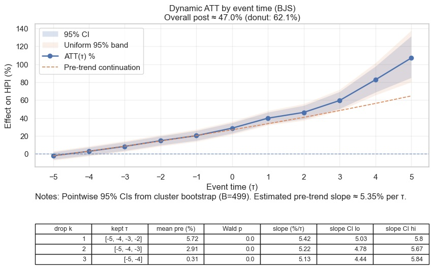  


